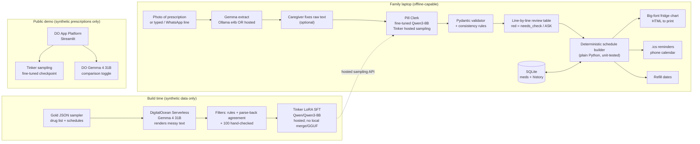
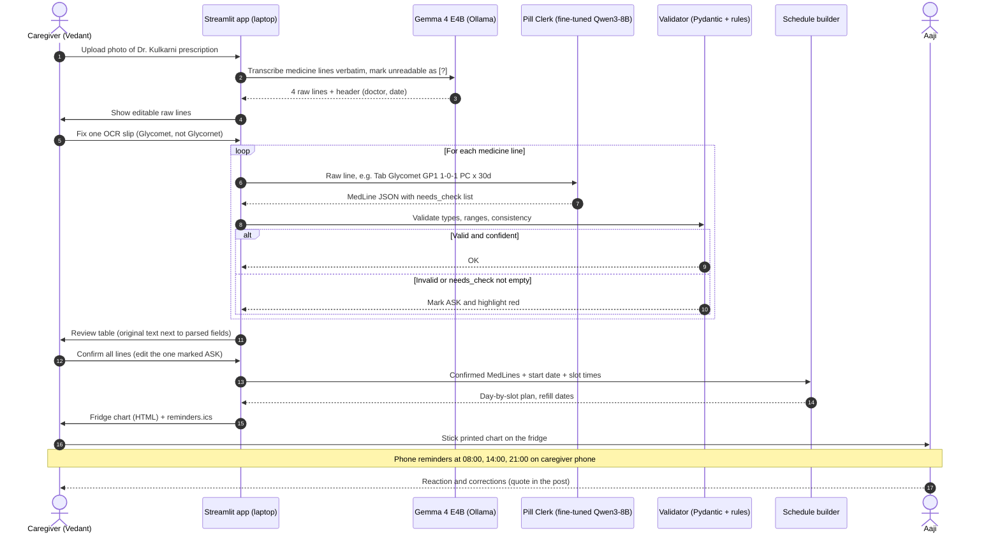
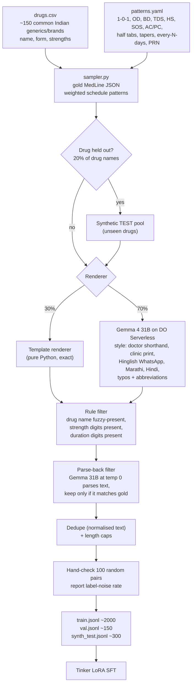
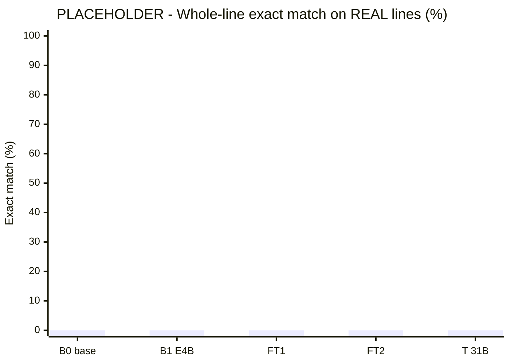
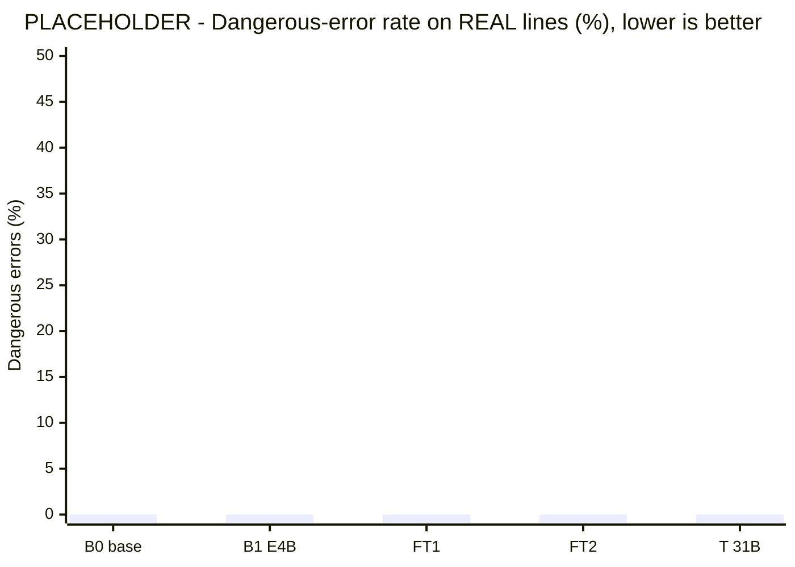
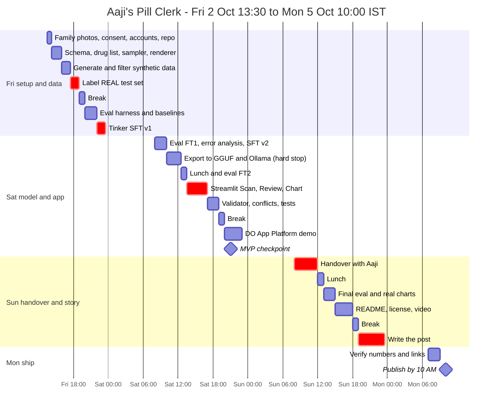

# Aaji's Pill Clerk 💊: one-file build plan
*DEV Hacktoberfest Weekend Challenge "Build for a Friend". For Vedant. Prepared Fri 2 Oct 2026, ~1 PM IST.*

> **Hard deadline: Mon 5 Oct 2026, 12:29 PM IST** (06:59 UTC). **Target: published by Mon 10:00 AM IST.**
> This file stands alone; you don't need any other document. Every number marked `TODO` or `[fill]` must come from your own runs. Never fake a number.
>
> **Weekend overrides (source of truth over later sections):**
> 1. **Do not** download, merge, or convert the fine-tuned model locally. Skip every GGUF/merge step. The fine-tuned Qwen3-8B is trained **and** served through **Tinker's hosted API only**.
> 2. Every model call sits behind an env switch: `LLM_BACKEND`, `EXTRACT_BACKEND`, `PARSER_BACKEND`. Photo reading can use local Ollama `gemma4:e4b` **or** hosted Gemma if disk cannot fit it. Default `EXTRACT_BACKEND=hosted`.
> 3. Big-model calls (synthetic data generation, the teacher baseline) go through DigitalOcean's OpenAI-compatible endpoint (`https://inference.do-ai.run/v1`, `gemma-4-31B-it`). An optional **Backboard** backend shares the same chat interface; do not depend on it.

---

## Contents
1. [TL;DR](#1-tldr)
2. [The person and the problem](#2-the-person-and-the-problem)
3. [Why it can win](#3-why-it-can-win)
4. [Eligibility and rules that shape the build](#4-eligibility-and-rules-that-shape-the-build)
5. [Architecture](#5-architecture)
6. [One prescription through the app (sequence)](#6-one-prescription-through-the-app)
7. [Synthetic data generation pipeline](#7-synthetic-data-generation-pipeline)
8. [Eval design and results template](#8-eval-design-and-results-template)
9. [Medical safety framing](#9-medical-safety-framing)
10. [Tech stack (exact versions)](#10-tech-stack-exact-versions)
11. [Key code](#11-key-code)
12. [Running the model locally + Tinker API fallback](#12-running-the-model-locally--tinker-api-fallback)
13. [Hour-by-hour plan (table + gantt)](#13-hour-by-hour-plan)
14. [MVP line and scope cuts](#14-mvp-line-and-scope-cuts)
15. [Demo video script](#15-demo-video-script)
16. [Write-up outline](#16-write-up-outline)
17. [Repo skeleton](#17-repo-skeleton)
18. [First commands](#18-first-commands)
19. [Accounts and credits checklist](#19-accounts-and-credits-checklist)
20. [Risks and mitigations](#20-risks-and-mitigations)
21. [Appendix A: verified public datasets](#appendix-a-verified-public-datasets-food-sales)
22. [Appendix B: alternates](#appendix-b-alternates-summarised)
23. [Appendix C: sources](#appendix-c-sources)

---

## 1. TL;DR

**Build "Aaji's Pill Clerk"**, a local-first assistant that turns a grandparent's messy medicine instructions into a schedule a family can trust. The inputs are handwritten or printed prescriptions, medicine strips, and WhatsApp lines like *"subah ek, raat ko aadhi, khane ke baad"*. The outputs are a **big-font fridge chart** (Marathi/Hindi/English), **phone calendar reminders (`.ics`)**, and **refill dates**.

- **Gemma 4 E4B** (open weights, Apache 2.0) runs **locally via Ollama** and reads the prescription photo into raw text lines.
- **A small open model, Qwen3-8B, fine-tuned with Tinker** (LoRA SFT) turns each messy line ("Tab Glycomet GP1 1-0-1 PC x 30d", "सकाळी एक, रात्री अर्धी") into **strict JSON**. When it isn't sure, it says **"ASK"** instead of guessing.
- **DigitalOcean Serverless Inference (Gemma 4 31B)** writes the training data using a trick that makes the labels **correct by construction**: code generates the answer (JSON) first, then Gemma 31B writes the messy human version of it. Gemma 31B is also the zero-shot "teacher ceiling" in the eval. DO App Platform hosts a public demo that uses only synthetic prescriptions.
- **The headline result** is a measured table on **real, held-out prescription lines from your family**: base Qwen3-8B vs **fine-tuned Qwen3-8B** vs Gemma 4 E4B vs Gemma 4 31B. It reports exact match, **dangerous-error rate**, and latency/cost on the laptop. This is precisely what the Tinker category asks for: *"show a clear improvement in performance, latency, or cost over a baseline."*
- **A human signs off on every line.** The tool copies what the doctor wrote. It never advises on doses.

**Categories entered:** Best Use of **Tinker** (featured, $200, core), Best Use of **Gemma** (featured, $200), Best Use of **DigitalOcean** (featured, $200; enter **only** if the DO demo is live at submission), plus the **overall** prize ($250 + DEV++).
**Cost:** ≈ **$2–6 total** (DO tokens ≈ $0.50, Tinker training ≈ $1, App Platform ≈ $1–2, and a little extra for a v2 run).
**Why this idea over the forecasting one:** it needs **no historical data from the friend**. The family already has everything required: a file of prescriptions.

---

## 2. The person and the problem

**Persona (replace with your real person; the code doesn't change).** **Aaji** is 74 and lives with your family (or your friend's grandmother in Pune). She takes **6–8 tablets a day** prescribed by **2–3 doctors**: a diabetologist, a cardiologist, and a GP for her knees. The prescriptions live in a plastic folder. Some are printed by clinic software, some are scrawled. Instructions arrive in three languages and four notations: `1-0-1`, `BD`, `TDS`, `HS`, `SOS`, `AC/PC`, `½ tab`, `x 5 days then 0-0-1`, plus whatever the caregiver typed on WhatsApp ("Papa ne bola BP wali ab sirf raat ko").

**The problem in her family's words:** *"Kaunsi goli kab? Last month doctor ne ek change kiya tha… which one?"* The steel pill box gets refilled from memory. When a dose changes, the old chart on the fridge stays wrong for weeks. Refills run out on a Sunday night.

**What she needs:**
1. One chart on the fridge, in big letters, in *her* language, that matches the latest prescriptions.
2. A reminder on the caregiver's phone.
3. A warning **before** a strip runs out.
4. Nothing that "decides" anything medical.

**Why it's compelling to write about:**
- It's universal in Indian families and instantly visual: the folder, the steel box, the fridge.
- It has a technical heart: shorthand is a tiny "language", and a fine-tuned 8B learns it.
- It has an honest edge: the model is trained to say **"ASK"**.
- The handover is a real scene: you print the chart, stick it on the fridge, set the reminders, and write down what Aaji said.

**Go/no-go (Fri 2 PM):** can you photograph **≥15 real prescriptions** (family + friends' families, with consent)? If yes, go. If you only get 5–8, still go, but add **WhatsApp-style instructions typed by the actual caregivers** as extra real test lines.

---

## 3. Why it can win

### 3.1 Judging criteria
| Criterion (official order; writing weighted most) | How this entry scores |
|---|---|
| **Writing quality** | A built-in story: the folder → the chart that went stale → "the answer first, then the question" → the results table → the line the model refused to guess → Aaji's reaction. A real number goes in the title, as in past winners. |
| **Relevance to prompt & theme** | One real person, a real handover. Open-source AI **is** the product: an open model is fine-tuned and **runs on the family laptop with the internet off**, and prescriptions never leave the house. |
| **Creativity** | A fresh take on a familiar problem. It isn't a reminder app with a chatbot: it's **distillation into a domain model for Indian prescription shorthand**, with correct-by-construction synthetic data, a *dangerous-error* metric, and abstention as a feature. |
| **Technical execution** | Held-out **real** test set, four-way comparison, bootstrap confidence intervals, a v1 → v2 iteration driven by error analysis, a Tinker ↔ Ollama parity check, unit tests on the deterministic schedule builder and `.ics` output. |
| **Use of partner tech** | **Tinker:** the fine-tune *is* the model; remove it and accuracy drops to the base number. **Gemma:** local OCR plus the 31B teacher that writes every training example. **DigitalOcean:** serverless Gemma 31B generates the data and is the eval ceiling; App Platform hosts the demo. Each one is load-bearing. |

### 3.2 Competition read (snapshot of the #hf26challenge feed at ~12:10 PM IST Fri, 27 project posts)
- **Topics already taken:** study buddy/quiz ×3, grandpa voice-memo recipe book ×2, meal planner, language tutor, sign-language translator, offline first aid, placement assistant, document Q&A, meeting copilot, a voice assistant that calls a grandmother, a guardrails layer, a finance coach for a bubble-tea shop. **Nobody is doing medication schedules or fine-tuning.**
- **Partner mentions:** Gemma in 10 of 27 posts. **Tinker, DigitalOcean and TabPFN in 0.** Expect a few hundred entries by Monday. Gemma will be the most crowded category. Tinker has a natural moat: it takes real ML work, and most weekend entries won't attempt a measured fine-tune.
- **What won recent DEV weekend challenges:**
  - A **data-backed finding** in the title (e.g. "I checked 328,186 tax returns").
  - **Partner tech doing real work**.
  - A **"What is real and what is not"** section.
  - **Declining a category** whose integration wasn't live.
  - Winners had only **8–11 reactions**, so judges pick them, not likes.
- **Honest odds:**
  - Tinker is the best shot at $200.
  - DigitalOcean is a thin pool, but "just hosting" entries are common, so the serverless-data-generation role must be visible.
  - Gemma is a long shot.
  - The overall prize needs the strongest write-up in the field. The handover plus the measured table is the formula.
- **Not entering:** ElevenLabs, Mastra, MongoDB, Sentry, Render, etc. They'd be bolted on. (Render is a featured category, but it's only the fallback host here. If you end up hosting on Render instead of DO, enter Render and drop DO.)

---

## 4. Eligibility and rules that shape the build
- **You're eligible from India.** MLH's General Contest Official Rules exclude only residents of Afghanistan, Belarus, Central African Republic, Cuba, Equatorial Guinea, Iran, Iraq, Kosovo, Libya, Myanmar, North Korea, Russia, South Sudan, Sudan, Syria, Tanzania, Venezuela, Yemen, and sanctioned parties.
  - You also need to be **18+** with an active DEV account in good standing.
  - The post must be **in English** for prize eligibility.
  - You can't be an MLH or sponsor employee (or a household member of one), and entering must not violate your employer's policies.
  - Winners may need to sign an affidavit/release and give tax info within 7 business days.
- **The project must be new.** "Development of your Entry was started during, and not prior to, the Entry Period." Start a **fresh repo today** and copy **no code** from MediClarity, Nexus Forge or swiggy-dispatch-copilot. Note any post-deadline commits in the README.
- **Required post elements:**
  - Use the submission template (it adds #devchallenge, #weekendchallenge, #hf26challenge).
  - Say what you built and **who it's for**.
  - Include a **demo** (deployed link or video) and a **code link**.
  - Answer **"Why does open innovation matter for what you built?"**
- **Open source at the core.** The rules say *"the open pieces should be what makes your project work."* Here: open-weight Gemma 4 and Qwen3, local inference, and a fine-tune you can only do and run because the weights are open.
- **Bonus:** *"Bonus points if you actually hand it over and tell us what they said."*
- **Entries:** one per person (the first one counts), one win per challenge. One post enters every category it genuinely uses. AI assistance is allowed. DEV labels AI-assisted posts, so write the prose yourself.
- **Prizes:**
  - Overall: $250 + DEV++ + badge.
  - Featured categories: $200 each (Render, TabPFN, Tinker, Arduino, DigitalOcean, Gemma).
  - Partner categories: $100 each.
  - Everyone with a valid entry gets a completion badge.
- **Free credits:** Tinker, Render, Backboard and ElevenLabs offer credits at **hacktoberfest.com/my/promos** (amounts can't be seen without logging in, so claim them first thing).
- **Licenses you rely on:**
  - **Gemma 4: Apache 2.0.** No restrictions on using its outputs as training data.
  - **Qwen3-8B: Apache 2.0.**
  - Your repo: Apache-2.0, with a NOTICE file listing both.

---

## 5. Architecture



**What leaves the laptop (put this table in the post):**
| Data | Where it goes | Why |
|---|---|---|
| Real prescription photos, names, doctors, dates | **Nowhere.** They stay on the laptop | OCR and Pill Clerk run locally |
| Synthetic prescriptions | DO Serverless, Tinker | Training-data generation and fine-tuning |
| **De-identified** real test lines (drug + schedule text only; no names/dates/clinic), with consent | Tinker (base-model sampling) and DO (31B baseline), **eval only** | To measure baselines fairly. Say so in the post. If the family says no, skip the cloud baselines on the real set and report them on synthetic only. |

### 5.1 Data-flow steps (runtime)
1. **Capture.** The caregiver snaps a prescription, a strip, or pastes a WhatsApp line into the Streamlit app (`app/pages/1_Scan.py`).
2. **Read (Gemma 4 E4B, local).** The photo goes to `ollama.chat(model="gemma4:e4b", images=[...])` with a prompt to transcribe each medicine line **verbatim**, one per line, writing `[?]` for unreadable characters. The output is a list of raw lines plus the doctor/date header (kept locally).
3. **Fix the text (human, optional).** The raw lines appear in an editable text area. The caregiver corrects OCR mistakes. Pill Clerk is trained on *text*, so this step isolates handwriting problems from interpretation problems.
4. **Interpret (Pill Clerk, Tinker hosted).** Each line goes to the fine-tuned Qwen3-8B via Tinker's sampling API (`PARSER_BACKEND=tinker`). Anything uncertain goes into `needs_check`. Local GGUF/`ollama` is a later option if disk allows.
5. **Validate.** Pydantic checks types and ranges, and consistency rules apply (taper must have steps, PRN must have no fixed slots, dose ≤ 4 tabs per slot, etc.). Failures get one retry, then the line is marked **ASK**.
6. **Review (human, required).** A table shows each line next to the original text. Red cells are `needs_check` or ASK. The caregiver confirms or edits, and nothing proceeds until every line is confirmed. The edits are logged, so you can count how often the human had to correct the model, a real-world metric for the post.
7. **Build schedule (deterministic).** Plain Python turns the confirmed `MedLine`s plus the start date and slot times (08:00 / 14:00 / 21:00, configurable) into a day-by-slot plan, including tapers and every-N-days schedules.
8. **Outputs:**
   - **Fridge chart:** HTML with 28–36 pt Devanagari/Latin text, ☀️/🌤️/🌙 columns, and "½ गोली" spelled out. Print it from the browser.
   - **`.ics`:** one recurring event per medicine slot with an alarm. Import it on the caregiver's phone.
   - **Refill dates:** from the strip count and daily total.
9. **Store.** SQLite keeps the active meds plus a history of every change ("BP tablet changed to night-only on 28 Sep, per Dr. X"), the thing the family actually lost track of.

---

## 6. One prescription through the app



---

## 7. Synthetic data generation pipeline

**The core idea: generate the answer first, then the question.** If you ask a big model to *label* messy text, its mistakes become your labels. Instead:
1. **Code samples the gold JSON** from a realistic distribution.
2. **Gemma 4 31B writes the messy human text** for that JSON.

The label is right by construction. The only remaining risk is that the *rendering* drops or changes information, and that risk is filtered (step 4).



**Distribution choices** (write these in the post; they show care):
- **Schedules:**
  - `1-0-1` 25%, `1-0-0` 20%, `0-0-1` 15%, `1-1-1` 10%, half-tab patterns 7%, PRN/SOS 8%, tapers 7%, every-N-days 5% (e.g. Vitamin D3 60K weekly), other 3%. These are **top-level** shares of non-hard-negative lines (`data/patterns.yaml` `line_mix`), not nested under `kind=daily`.
  - Durations: 3/5/7/10/15/30/60/90 days or "continue". Weekly lines use 30/60/90/continue only.
  - Drugs whose name/strength is Vitamin D3 / 60K IU are always sampled as weekly OD (the IDEA example).
- **Forms:** tablet/capsule 80%; syrup (ml), drops, inhalers (puffs), insulin (units), creams make up the rest.
- **Styles:**
  - Clinic-printed English 25%, doctor shorthand 25%, Hinglish WhatsApp 20%, Hindi Devanagari 10%, Marathi Devanagari 10%, mixed 10%.
  - Noise ops: dropped dots ("tab." → "tab"), unit squashing ("500mg"), common misspellings, line-number prefixes, ℞ marks.
- **Hard negatives (5%):** lines that must produce `needs_check`. Examples: missing frequency ("Tab Pan 40 x 5d"), "as directed", partially illegible "[?]". This teaches **abstention**.
- **Split by drug name.** The synthetic test set uses drugs never seen in training, so you measure generalisation, not memorisation.
- **Cost:**
  - ~2,500 render calls + ~2,500 parse-back calls at ~250 tokens each ≈ 1.3M tokens.
  - On DO Gemma 4 31B ($0.18/M in, $0.50/M out) that's **≈ $0.50**.
  - DO's max output for this model is 8,192 tokens; you need ~100.
- **Bias to disclose:** the parse-back filter keeps only lines the teacher can parse, which slightly flatters the teacher on synthetic test data. That's one more reason the **real** set is the headline.

---

## 8. Eval design and results template

### 8.1 Test sets
| Set | Size target | Source | Role |
|---|---|---|---|
| **REAL** (headline) | **≥ 80 medicine lines** from **15–25 prescriptions** + ~20 real caregiver WhatsApp instructions | Your family and friends' families, with consent, **never used in training**. Human-transcribed text (so OCR errors don't contaminate interpretation scores). Gold labels typed by you and double-checked by a second person (a parent or the caregiver). | The number in the title |
| SYNTH-TEST | ~300 lines | Generated, **unseen drug names** | Generalisation + per-style breakdown |
| OCR-SET (secondary) | 10–15 photos | The same real prescriptions | Gemma E4B transcription character error rate (CER); printed vs handwritten |

### 8.2 Systems compared
| ID | System | Where it runs | Notes |
|---|---|---|---|
| B0 | Qwen3-8B **base**, same prompt + JSON instructions | Tinker sampling (`base_model="Qwen/Qwen3-8B"`) | The baseline the Tinker category compares against |
| B1 | Gemma 4 E4B zero-shot | Laptop, Ollama | "Why not just use the local Gemma?" |
| **FT1 / FT2** | **Qwen3-8B + LoRA (Tinker)**, v1 and v2 | Tinker sampling + laptop (Ollama Q4_K_M) | The product |
| T | Gemma 4 31B zero-shot | DO Serverless | Teacher / ceiling |

### 8.3 Metrics
- **JSON validity rate:** parses and passes the Pydantic schema.
- **Field accuracy** per field: drug, strength, form, dose (all three slots + unit), food, duration_days, schedule_type/taper, prn.
- **Whole-line exact match:** all fields correct. This is the headline.
- **Dangerous-error rate:** a line where *dose, slot, or duration* is wrong **and** the model did **not** flag it in `needs_check`. This is the metric that matters for safety. Lower is better.
- **Abstention quality:** precision and recall of `needs_check` against lines a human marked ambiguous.
- **Latency:** p50/p95 seconds per line on *your laptop* (Ollama) and via API. **Cost:** ₹ per 1,000 lines.
- **Uncertainty:** with n ≈ 80–100, report **95% bootstrap CIs** (1,000 resamples), and pair them with a **McNemar test** for B0 vs FT on exact match. Don't over-claim. If the CIs overlap, say so.
- **Human corrections at handover:** the share of lines the caregiver edited in the review table during the real use on Sunday.

### 8.4 Results table template (fill from `eval/results.md`; leave blank until measured)
| System | JSON valid | Exact match (REAL) [95% CI] | Dangerous errors (REAL) | Exact match (SYNTH) | p50 s/line (laptop) | ₹ / 1k lines |
|---|---|---|---|---|---|---|
| B0 Qwen3-8B base | TODO | TODO | TODO | TODO | TODO | TODO |
| B1 Gemma 4 E4B | TODO | TODO | TODO | TODO | TODO | 0 |
| FT1 Qwen3-8B + LoRA v1 | TODO | TODO | TODO | TODO | TODO | 0 (local) |
| FT2 Qwen3-8B + LoRA v2 | TODO | TODO | TODO | TODO | TODO | 0 (local) |
| T Gemma 4 31B (DO) | TODO | TODO | TODO | TODO | n/a (API) | TODO |

**Per-field accuracy (REAL), FT2 vs B0:** drug `TODO` · strength `TODO` · dose `TODO` · food `TODO` · duration `TODO` · taper `TODO` · prn `TODO`.

### 8.5 Chart placeholder

> ⚠️ **PLACEHOLDER: ALL VALUES BELOW ARE ZERO ON PURPOSE.** Replace the `bar [...]` arrays with the numbers from `eval/results.md` after Saturday's eval. **Never publish this chart with placeholder values.**





### 8.6 Error analysis → v2 (this iteration is a story beat)
After FT1:
1. Bucket every REAL and SYNTH error by type: taper misread, half-tab, Marathi time words, PRN vs fixed, duration units ("1/12" = 1 month), brand-combo strength ("GP1" = glimepiride 1 mg + metformin 500 mg).
2. Generate ~300–500 targeted synthetic examples for the top 2–3 buckets.
3. Retrain as FT2 (same hyperparameters, more data).
4. Report **both** FT1 and FT2. If FT2 doesn't help, say so.

---

## 9. Medical safety framing
Put this near the top of the README and in the post.

- **It's a clerk, not a clinician.** It **copies** what the prescription says into a schedule. It does **not** suggest doses, check interactions, recommend substitutes, or interpret symptoms. The UI and the post never use the words "advice" or "recommend" about medicine.
- **"ASK" is a feature.** The model is trained (via hard negatives) to put uncertain fields in `needs_check`. Missing or unreadable values show as **"ASK"** in red. They're never filled with a guess, and the chart can't be printed until every red cell is resolved by a human.
- **A human signs off on every line.** The chart footer reads *"Copied from Dr. ___'s prescription dated ___. Checked by ___ on ___. If anything looks different from the prescription, ask the doctor or pharmacist."*
- **Deterministic maths.** Slot expansion, tapers, durations and refill dates are plain, unit-tested Python, never the LLM.
- **Conflicts are surfaced, not resolved.** If two prescriptions mention the same drug with different schedules, the app shows both with dates and asks which is current. It never picks one.
- **Privacy:**
  - Photos, names and doctors stay on the laptop.
  - De-identified test lines go to cloud APIs only with explicit consent (see §5).
  - Real data is gitignored; the public demo uses synthetic prescriptions only.
- **Not a medical device.** The README says it's a personal family tool built in a weekend and not validated for clinical use. Keep it separate from MediClarity (different problem, no shared code).
- **Consent:** get verbal consent from Aaji and the caregiver for photos, quotes and any video. Blur doctor names and clinic letterheads in screenshots.

---

## 10. Tech stack (exact versions)
Versions checked on PyPI on **2 Oct 2026**. Pin them in `pyproject.toml`.

| Layer | Choice | Version | Why |
|---|---|---|---|
| Language/runtime | Python | **3.12** (tinker needs ≥3.11) | One language for training, eval and UI |
| Package manager | `uv` | latest | Fast, lockfile |
| Fine-tuning | `tinker` | **0.31.0** | Thinking Machines' training/sampling SDK |
| Fine-tuning helpers | `tinker-cookbook` | **0.5.7** | Optional extra `train`. **Blocked on Windows:** `tml-renderers` 0.1.0 has no `win_amd64` wheel (manylinux + macosx only). Install on WSL/Linux for SFT. Sampling uses the `tinker` SDK, which does install on Windows. |
| Student model | `Qwen/Qwen3-8B` (Apache 2.0) | — | Dense standard architecture: clean merge + GGUF. Tinker price **$0.44/M train tokens**, $0.195/M prefill, $0.60/M sample. Renderer **`qwen3_disable_thinking`** (no `<think>` in JSON outputs). |
| Local LLM runtime | Ollama + `ollama` (Python) | **0.6.3** | Optional `EXTRACT_BACKEND=ollama` for `gemma4:e4b`. Parser GGUF skipped this weekend. |
| Local vision/OCR | `gemma4:e4b` (Apache 2.0) **or hosted Gemma** | Ollama tag / DO | Default `EXTRACT_BACKEND=hosted` so the laptop need not store the vision weights |
| YAML | `pyyaml` | **6.0.3** | `data/patterns.yaml` (not in the original pin list; added because the sampler reads YAML) |
| Teacher / data generation | DO Serverless Inference, model **`gemma-4-31B-it`** via `openai` | **3.23.0** | OpenAI-compatible at `https://inference.do-ai.run/v1`. $0.18/M in, $0.50/M out (prepaid). The DO docs don't list image input or structured outputs for Gemma, so use JSON-in-prompt + Pydantic. |
| Schemas | `pydantic` | **2.13.5** | One schema for training targets, validation and Ollama `format` |
| Data | `pandas` | **3.0.6** | Eval tables |
| UI | `streamlit` | **1.64.0** | Scan → Review → Chart pages |
| Calendar | `icalendar` | **7.3.0** | `.ics` with RRULE + VALARM |
| Images | `pillow` | **12.3.0** | Resize photos before OCR |
| HTTP | `httpx` | **0.28.1** | (Optional) async DO calls |
| Fuzzy matching | `rapidfuzz` | 3.14.6 | Drug-name filter |
| Tests | `pytest` | **9.1.1** | Schedule/ICS/validator tests |
| GGUF conversion | **skipped this weekend** | — | Low disk: no download / merge / GGUF. Parser stays on Tinker hosted API. |
| Hosting | DO App Platform | `apps-s-1vcpu-1gb-fixed` ($10/mo, per-second billing) | Public demo, synthetic data only |

---

## 11. Key code
These are sketches written against the real APIs (Tinker 0.31 / tinker-cookbook 0.5.7 source inspected). Expect small fixes when you run them.

### 11.1 Schema: `pillclerk/schema.py`
```python
from typing import Literal
from pydantic import BaseModel, Field, model_validator

Form = Literal["tab", "cap", "syrup", "drops", "inhaler", "injection", "cream", "sachet", "other"]
Unit = Literal["tab", "cap", "ml", "drop", "puff", "unit", "sachet", "apply"]
Food = Literal["before", "after", "with", "empty_stomach", "any"]
Kind = Literal["daily", "prn", "taper"]
CheckField = Literal["drug", "strength", "dose", "food", "duration_days", "schedule"]


class Dose(BaseModel):
    morning: float = Field(0, ge=0, le=20)    # tablets, ml, drops, puffs or units per slot
    afternoon: float = Field(0, ge=0, le=20)
    night: float = Field(0, ge=0, le=20)
    unit: Unit = "tab"

    @model_validator(mode="after")
    def plausible(self):
        if self.unit in ("tab", "cap") and max(self.morning, self.afternoon, self.night) > 4:
            raise ValueError("more than 4 tablets in one slot: flag for a human instead")
        return self


class TaperStep(BaseModel):
    dose: Dose
    days: int = Field(ge=1, le=90)


class MedLine(BaseModel):
    """One medicine line, copied (never inferred) from a prescription."""
    drug: str | None                      # as written, spelling normalised; None = unreadable
    strength: str | None = None           # "500 mg", "60K IU"; None = not written
    form: Form = "tab"
    kind: Kind = "daily"
    dose: Dose | None = None              # daily schedule (None for prn/taper)
    every_n_days: int = Field(1, ge=1, le=30)   # 7 = weekly
    taper: list[TaperStep] = []
    food: Food = "any"
    duration_days: int | None = None      # None = not written / "continue"
    prn_max_per_day: int | None = None
    note: str | None = None               # "left eye", "apply on knees"
    needs_check: list[CheckField] = []    # model was not sure -> human must check

    @model_validator(mode="after")
    def consistent(self):
        if self.kind == "taper" and not self.taper:
            raise ValueError("taper needs steps")
        if self.kind == "daily" and self.dose is None and "dose" not in self.needs_check:
            raise ValueError("daily line without dose must be flagged")
        if self.kind == "prn" and self.dose and (self.dose.morning + self.dose.afternoon + self.dose.night):
            raise ValueError("prn lines have no fixed slots")
        return self


SYSTEM_PROMPT = (
    "You are Pill Clerk. Convert ONE prescription line into JSON matching the MedLine schema. "
    "Copy only what is written. Never guess: if a field is missing or unreadable, leave it null "
    "and add it to needs_check. Output JSON only."
)
```

### 11.2 Gold sampler + DO renderer: `pillclerk/sampler.py`, `pillclerk/render.py`
```python
# sampler.py: the answer first
import random
from .schema import MedLine, Dose, TaperStep

PATTERNS = [((1, 0, 1), 25), ((1, 0, 0), 20), ((0, 0, 1), 15), ((1, 1, 1), 10),
            ((0.5, 0, 0.5), 3), ((1, 0, 0.5), 2), ((0.5, 0, 0), 2), ((0, 1, 0), 2), ((2, 0, 2), 1)]
DURATIONS = [3, 5, 7, 10, 15, 30, 60, 90, None]

def sample_line(rng: random.Random, drug: dict) -> MedLine:
    kind = rng.choices(["daily", "prn", "taper"], [85, 8, 7])[0]
    unit = {"syrup": "ml", "drops": "drop", "inhaler": "puff", "injection": "unit"}.get(drug["form"], "tab")
    base = dict(drug=drug["name"], strength=rng.choice(drug["strengths"]) or None,
                form=drug["form"], food=rng.choice(["after", "after", "before", "any", "empty_stomach"]))
    if kind == "prn":
        return MedLine(**base, kind="prn", prn_max_per_day=rng.choice([2, 3, None]),
                       duration_days=rng.choice([3, 5, None]))
    if kind == "taper":
        steps = [TaperStep(dose=Dose(morning=1, night=1, unit=unit), days=5),
                 TaperStep(dose=Dose(night=1, unit=unit), days=5)]
        return MedLine(**base, kind="taper", taper=steps, duration_days=10)
    (m, a, n) = rng.choices([p for p, _ in PATTERNS], [w for _, w in PATTERNS])[0]
    k = {"ml": 5, "drop": 2, "unit": 10}.get(unit, 1)              # 5 ml syrup, 2 drops, 10 units
    return MedLine(**base, dose=Dose(morning=m * k, afternoon=a * k, night=n * k, unit=unit),
                   every_n_days=rng.choices([1, 7], [95, 5])[0], duration_days=rng.choice(DURATIONS))
```
```python
# render.py: then the question (Gemma 4 31B on DigitalOcean Serverless Inference)
import os, json, re
from openai import OpenAI
from .schema import MedLine, SYSTEM_PROMPT

do = OpenAI(base_url="https://inference.do-ai.run/v1", api_key=os.environ["DO_MODEL_ACCESS_KEY"])
TEACHER = "gemma-4-31B-it"
STYLES = {
    "clinic_print": "Printed clinic software line, e.g. 'TAB. X 500MG  1-0-1  AFTER FOOD  x 30 DAYS'",
    "doctor_short": "Indian doctor's handwritten shorthand: OD/BD/TDS/HS/SOS, AC/PC, 1-0-1, x5d, 1/12",
    "hinglish_wa": "A caregiver's WhatsApp message in Hinglish, casual, may skip the strength",
    "marathi": "Marathi in Devanagari as a family member would write it (सकाळी/दुपारी/रात्री, जेवणानंतर)",
    "hindi": "Hindi in Devanagari (सुबह/दोपहर/रात, खाने के बाद)",
}
RENDER_SYS = ("Write ONE realistic prescription or instruction line that encodes EXACTLY the JSON given. "
              "Do not add or drop information. Use the requested style. Output the line only.")

def render(gold: MedLine, style: str) -> str:
    r = do.chat.completions.create(
        model=TEACHER, temperature=0.9, max_tokens=120,
        messages=[{"role": "system", "content": RENDER_SYS},
                  {"role": "user", "content": f"STYLE: {STYLES[style]}\nJSON: {gold.model_dump_json(exclude_defaults=True)}"}])
    return r.choices[0].message.content.strip()

def parse_back(line: str) -> MedLine | None:          # agreement filter + teacher baseline (T)
    r = do.chat.completions.create(
        model=TEACHER, temperature=0, max_tokens=400,
        messages=[{"role": "system", "content": SYSTEM_PROMPT + "\nSchema: " + json.dumps(MedLine.model_json_schema())},
                  {"role": "user", "content": line}])
    txt = re.sub(r"^`{3}(json)?|`{3}$", "", r.choices[0].message.content.strip()).strip()  # drop code fences
    try:
        return MedLine.model_validate_json(txt)
    except Exception:
        return None

def to_chat_row(line: str, gold: MedLine) -> dict:      # Tinker conversation JSONL format
    return {"messages": [{"role": "system", "content": SYSTEM_PROMPT},
                         {"role": "user", "content": line},
                         {"role": "assistant", "content": gold.model_dump_json(exclude_defaults=True)}]}
```

### 11.3 Tinker LoRA SFT training loop: `train/sft.py`
A flat loop adapted from `tinker_cookbook/recipes/sl_loop.py`. The zero-code alternative is `sl_basic.py` with `FromConversationFileBuilder(file_path="data/synth/train.jsonl")`.
```python
import json, random, time
import tinker
from tinker_cookbook import renderers, hyperparam_utils
from tinker_cookbook.renderers import TrainOnWhat
from tinker_cookbook.supervised.data import conversation_to_datum
from tinker_cookbook.supervised.common import compute_mean_nll
from tinker_cookbook.tokenizer_utils import get_tokenizer

MODEL, RENDERER = "Qwen/Qwen3-8B", "qwen3_disable_thinking"
RANK, BATCH, EPOCHS, MAXLEN = 32, 64, 3, 1024
LR = hyperparam_utils.get_lr(MODEL)            # calibrated LoRA LR for Qwen-family models

load = lambda p: [json.loads(l) for l in open(p, encoding="utf-8")]
train_rows, val_rows = load("data/synth/train.jsonl"), load("data/synth/val.jsonl")
tok = get_tokenizer(MODEL)
renderer = renderers.get_renderer(RENDERER, tok)
to_datum = lambda r: conversation_to_datum(r["messages"], renderer, MAXLEN, TrainOnWhat.LAST_ASSISTANT_MESSAGE)
val_batch = [to_datum(r) for r in val_rows]

service = tinker.ServiceClient()                                   # reads TINKER_API_KEY
tc = service.create_lora_training_client(base_model=MODEL, rank=RANK)

steps_per_epoch = len(train_rows) // BATCH
total = steps_per_epoch * EPOCHS
step = 0
for epoch in range(EPOCHS):
    random.Random(epoch).shuffle(train_rows)
    for b in range(steps_per_epoch):
        t0 = time.time()
        batch = [to_datum(r) for r in train_rows[b * BATCH:(b + 1) * BATCH]]
        lr = LR * max(0.0, 1 - step / total)                       # linear decay
        fb = tc.forward_backward(batch, loss_fn="cross_entropy")   # queue both, then wait
        op = tc.optim_step(tinker.AdamParams(learning_rate=lr, beta1=0.9, beta2=0.95, eps=1e-8))
        out = fb.result(); op.result()
        nll = compute_mean_nll([o["logprobs"] for o in out.loss_fn_outputs],
                               [d.loss_fn_inputs["weights"] for d in batch])
        msg = f"ep {epoch} step {step}/{total} lr {lr:.2e} train_nll {nll:.4f} {time.time()-t0:.1f}s"
        if step % 10 == 0:                                         # held-out NLL (no grad)
            v = tc.forward(val_batch, loss_fn="cross_entropy").result()
            vnll = compute_mean_nll([o["logprobs"] for o in v.loss_fn_outputs],
                                    [d.loss_fn_inputs["weights"] for d in val_batch])
            msg += f" val_nll {vnll:.4f}"
        print(msg, flush=True)
        step += 1

state = tc.save_state("pillclerk-v1").result().path                  # resumable
sampler = tc.save_weights_for_sampler("pillclerk-v1").result().path  # tinker://.../sampler_weights/...
json.dump({"state": state, "sampler": sampler, "model": MODEL, "renderer": RENDERER},
          open("train/checkpoint_v1.json", "w"), indent=2)
print("saved", sampler)
```
**Budget check:** 2,000 rows × ~250 tokens × 3 epochs ≈ 1.5M train tokens × $0.44/M ≈ **$0.66**, plus val forwards (prefill pricing) ≈ cents.

### 11.4 Inference backends: `pillclerk/infer.py`
```python
import ollama
from .schema import MedLine, SYSTEM_PROMPT

def parse_ollama(line: str, model: str = "pillclerk") -> MedLine | None:
    r = ollama.chat(model=model, think=False, format=MedLine.model_json_schema(),
                    options={"temperature": 0},
                    messages=[{"role": "system", "content": SYSTEM_PROMPT}, {"role": "user", "content": line}])
    try:
        return MedLine.model_validate_json(r.message.content)
    except Exception:
        return None

def make_tinker_parser(model_path: str | None = None, base_model: str = "Qwen/Qwen3-8B"):
    """model_path=tinker://... for the fine-tune, None for the base model (B0)."""
    import tinker
    from tinker_cookbook import renderers
    from tinker_cookbook.tokenizer_utils import get_tokenizer
    renderer = renderers.get_renderer("qwen3_disable_thinking", get_tokenizer(base_model))
    svc = tinker.ServiceClient()
    sc = (svc.create_sampling_client(model_path=model_path) if model_path
          else svc.create_sampling_client(base_model=base_model))
    params = tinker.SamplingParams(max_tokens=400, temperature=0.0, stop=renderer.get_stop_sequences())

    def parse(line: str) -> MedLine | None:
        prompt = renderer.build_generation_prompt(
            [{"role": "system", "content": SYSTEM_PROMPT}, {"role": "user", "content": line}])
        res = sc.sample(prompt=prompt, num_samples=1, sampling_params=params).result()
        msg, _ = renderer.parse_response(res.sequences[0].tokens)
        try:
            return MedLine.model_validate_json(renderers.get_text_content(msg))
        except Exception:
            return None
    return parse
```

### 11.5 Eval script: `eval/eval.py`
```python
"""Usage: uv run python -m eval.eval --system ft2 --set data/real/real_test.jsonl"""
import argparse, json, random, time
from statistics import median
from pillclerk.schema import MedLine

FIELDS = ["drug", "strength", "form", "kind", "dose", "every_n_days", "taper", "food",
          "duration_days", "prn_max_per_day"]
DANGER = ["dose", "taper", "duration_days", "every_n_days", "kind"]

def norm(v):
    return v.lower().replace(" ", "").replace(".", "") if isinstance(v, str) else v

def dump(v):
    return json.dumps(v, default=lambda m: m.model_dump(), sort_keys=True)

def field_eq(p: MedLine, g: MedLine, f: str) -> bool:
    a, b = getattr(p, f), getattr(g, f)
    if hasattr(a, "model_dump") or hasattr(b, "model_dump") or isinstance(a, list):
        return dump(a) == dump(b)
    return norm(a) == norm(b)

def score(pred: MedLine | None, gold: MedLine) -> dict:
    if pred is None:                                   # invalid JSON counts as dangerous
        return {"valid": 0, "exact": 0, "danger": 1, **{f: 0 for f in FIELDS}}
    fs = {f: int(field_eq(pred, gold, f)) for f in FIELDS}
    danger = int(any(not fs[f] for f in DANGER) and not pred.needs_check)   # wrong AND not flagged
    return {"valid": 1, "exact": int(all(fs.values())), "danger": danger, **fs}

def bootstrap_ci(xs, n=1000, seed=0):
    rng, k = random.Random(seed), len(xs)
    means = sorted(sum(rng.choices(xs, k=k)) / k for _ in range(n))
    return means[int(0.025 * n)], means[int(0.975 * n)]

def get_parser(system: str):
    from pillclerk import infer, render
    ck = lambda v: json.load(open(f"train/checkpoint_{v}.json"))["sampler"]
    return {"b0":        lambda: infer.make_tinker_parser(None),
            "b1":        lambda: (lambda l: infer.parse_ollama(l, "gemma4:e4b")),
            "ft1":       lambda: infer.make_tinker_parser(ck("v1")),
            "ft2":       lambda: infer.make_tinker_parser(ck("v2")),
            "ft2_local": lambda: (lambda l: infer.parse_ollama(l, "pillclerk")),
            "t31b":      lambda: render.parse_back}[system]()

if __name__ == "__main__":
    ap = argparse.ArgumentParser(); ap.add_argument("--system"); ap.add_argument("--set")
    a = ap.parse_args()
    parse = get_parser(a.system)
    rows = [json.loads(l) for l in open(a.set, encoding="utf-8")]   # {"line": str, "gold": {...}}
    scores, lat, preds = [], [], []
    for r in rows:
        t0 = time.time(); p = parse(r["line"]); lat.append(time.time() - t0)
        scores.append(score(p, MedLine.model_validate(r["gold"])))
        preds.append({"line": r["line"], "pred": p.model_dump() if p else None, **scores[-1]})
    mean = lambda k: sum(s[k] for s in scores) / len(scores)
    out = {"system": a.system, "set": a.set, "n": len(rows), "json_valid": mean("valid"),
           "exact": mean("exact"), "exact_ci95": bootstrap_ci([s["exact"] for s in scores]),
           "danger": mean("danger"), "per_field": {f: mean(f) for f in FIELDS},
           "p50_s": median(lat), "p95_s": sorted(lat)[max(0, int(0.95 * len(lat)) - 1)]}
    print(json.dumps(out, indent=2))
    tag = a.set.split("/")[-1].removesuffix(".jsonl")
    json.dump(out, open(f"eval/out/{a.system}_{tag}.json", "w"), indent=2)
    with open(f"eval/out/{a.system}_{tag}_preds.jsonl", "w", encoding="utf-8") as fh:  # error analysis
        fh.writelines(json.dumps(x, ensure_ascii=False) + "\n" for x in preds)
```
`eval/report.py` then builds `eval/results.md` (the §8.4 table) and runs the McNemar test from the `*_preds.jsonl` files.

### 11.6 Schedule, `.ics` reminders and fridge chart: `pillclerk/schedule.py`, `ics.py`, `chart.py`
```python
# schedule.py: deterministic and unit-tested; the LLM never does this maths
from dataclasses import dataclass
from datetime import date, time, timedelta
from .schema import MedLine

SLOTS = {"morning": time(8, 0), "afternoon": time(14, 0), "night": time(21, 0)}

@dataclass
class Dosing:
    med: MedLine
    slot: str
    amount: float
    start: date
    days: int | None       # None = continue until changed
    every_n_days: int = 1

def expand(meds: list[MedLine], start: date) -> list[Dosing]:
    out = []
    for m in meds:
        if m.kind == "daily" and m.dose:
            for s in SLOTS:
                if (amt := getattr(m.dose, s)) > 0:
                    out.append(Dosing(m, s, amt, start, m.duration_days, m.every_n_days))
        elif m.kind == "taper":
            d0 = start
            for step in m.taper:
                for s in SLOTS:
                    if (amt := getattr(step.dose, s)) > 0:
                        out.append(Dosing(m, s, amt, d0, step.days))
                d0 += timedelta(days=step.days)
        # prn: printed on the chart as "only if needed"; no reminders
    return out

def refill_date(m: MedLine, start: date, units_in_stock: float) -> date | None:
    if not m.dose:
        return None
    per_day = (m.dose.morning + m.dose.afternoon + m.dose.night) / m.every_n_days
    return start + timedelta(days=int(units_in_stock // per_day)) if per_day else None
```
```python
# ics.py: one recurring event per medicine slot, with an alarm at the dose time
from datetime import datetime, timedelta
from icalendar import Calendar, Event, Alarm
from .schedule import Dosing, SLOTS

def frac(x: float) -> str:
    return {0.5: "½", 1.5: "1½"}.get(x, f"{x:g}")

def to_ics(plan: list[Dosing]) -> bytes:
    cal = Calendar()
    cal.add("prodid", "-//Pill Clerk//EN")
    cal.add("version", "2.0")
    for i, d in enumerate(plan):
        unit = d.med.dose.unit if d.med.dose else "tab"
        summary = f"💊 {d.med.drug} {d.med.strength or ''}: {frac(d.amount)} {unit} ({d.med.food})"
        ev = Event()
        ev.add("summary", summary)
        ev.add("dtstart", datetime.combine(d.start, SLOTS[d.slot]))   # floating local time = phone's zone
        ev.add("duration", timedelta(minutes=10))
        rule = {"freq": "daily", "interval": d.every_n_days}
        if d.days:
            rule["count"] = max(1, d.days // d.every_n_days)
        ev.add("rrule", rule)
        ev.add("uid", f"pillclerk-{i}-{d.start.isoformat()}@local")
        alarm = Alarm()
        alarm.add("action", "DISPLAY")
        alarm.add("description", summary)
        alarm.add("trigger", timedelta(0))
        ev.add_component(alarm)
        cal.add_component(ev)
    return cal.to_ical()
```
```python
# chart.py: big-font printable fridge chart (HTML; print from the browser, A4 landscape)
from html import escape
from .schedule import Dosing

LABELS = {
    "mr": {"morning": "☀️ सकाळी", "afternoon": "🌤️ दुपारी", "night": "🌙 रात्री", "tab": "गोळी",
           "after": "जेवणानंतर", "before": "जेवणाआधी", "with": "जेवणासोबत", "empty_stomach": "उपाशीपोटी", "any": ""},
    "hi": {"morning": "☀️ सुबह", "afternoon": "🌤️ दोपहर", "night": "🌙 रात", "tab": "गोली",
           "after": "खाने के बाद", "before": "खाने से पहले", "with": "खाने के साथ", "empty_stomach": "खाली पेट", "any": ""},
}

def chart_html(plan: list[Dosing], lang: str = "mr", footer: str = "") -> str:
    L = LABELS[lang]
    rows = []
    for slot in ("morning", "afternoon", "night"):
        cells = "".join(
            f"<div class='pill'><b>{escape(d.med.drug or 'ASK')}</b> {escape(d.med.strength or '')}"
            f"<br/>{'½' if d.amount == 0.5 else f'{d.amount:g}'} {L['tab']} · {L[d.med.food]}</div>"
            for d in plan if d.slot == slot) or "—"
        rows.append(f"<tr><th>{L[slot]}</th><td>{cells}</td></tr>")
    return f"""<!doctype html><meta charset="utf-8">
<style>@page{{size:A4 landscape;margin:12mm}} body{{font-family:'Noto Sans Devanagari','Noto Sans',sans-serif}}
th{{font-size:40px;text-align:left;padding:12px 24px;white-space:nowrap}} td{{font-size:30px}}
.pill{{display:inline-block;border:3px solid #333;border-radius:14px;padding:10px 18px;margin:8px}}
tr{{border-bottom:4px solid #999}} footer{{font-size:16px;margin-top:20px}}</style>
<table>{''.join(rows)}</table><footer>{escape(footer)}</footer>"""
```

---

## 12. Serving the fine-tune (Tinker hosted; no local GGUF)

**This weekend:** the laptop has little free disk. **Do not** download the adapter, merge into Hugging Face weights, convert to GGUF, or `ollama create pillclerk`. `train/export.py` exits with that message.

Set `PARSER_BACKEND=tinker` and `PILLCLERK_TINKER_PATH` to the `tinker://…/sampler_weights/…` path from `train/checkpoint_v1.json` (or v2). The Streamlit app and the DO demo both call Tinker sampling. App Platform has no GPU. Sampling is $0.60/M output tokens (cents for a demo).

Photo OCR: `EXTRACT_BACKEND=hosted` (DigitalOcean Gemma) by default. Switch to `EXTRACT_BACKEND=ollama` and `OLLAMA_EXTRACT_MODEL=gemma4:e4b` only if you later pull the local vision model.

Big-model calls (synthetic render + teacher parse-back + 31B baseline): `LLM_BACKEND=digitalocean` with `DO_MODEL_ACCESS_KEY`. Optional `LLM_BACKEND=backboard` uses the same `ChatBackend` interface; do not depend on it.

Honest line for the post: *"The fine-tune is trained and served on Tinker's hosted API. Local GGUF export is the next commit, once there is disk."*

**Stretch only (do not start unless disk and time exist):** the old download → merge → GGUF → Ollama path. It needs ~55 GB free. Skip it.

---

## 13. Hour-by-hour plan
All times IST. Breaks and sleep are included; protect them.

| When | Task | Done when |
|---|---|---|
| **Fri 13:30–14:15** | Call family. Collect prescription photos (≥15) + caregiver WhatsApp lines, and get consent. Sign up for Tinker and claim credits at hacktoberfest.com/my/promos. DO: billing + prepaid + model access key. **Do not** `ollama pull gemma4:e4b` unless disk allows (`EXTRACT_BACKEND=hosted` by default). **New repo, first commit.** | Photos in `data/real/raw/` (gitignored), keys in `.env` |
| 14:15–16:00 | `schema.py`, `drugs.csv` (~150 drugs, typed from strips + common generics), `sampler.py`, `render.py`, rule filter, template renderer. 20-sample smoke test on DO. | 20 good pairs printed |
| 16:00–17:30 | Generate ~2,500 pairs asynchronously (rate-limited), parse-back filter, dedupe, drug-held-out split, hand-check 100. | `train/val/synth_test.jsonl` + noise rate |
| 17:30–19:00 | Build `real_test.jsonl`: Gemma E4B OCR assists, **you** transcribe and label every field. Second person double-checks 30 lines. | ≥80 REAL lines |
| 19:00–20:00 | Break / dinner | — |
| 20:00–22:00 | `eval.py` + run baselines B0 (Tinker base), B1 (E4B local), T (DO 31B) on REAL + SYNTH. | Baseline rows in the results table |
| 22:00–23:30 | Smoke-test SFT on 50 rows, then launch Tinker SFT v1 (`train/sft.py`). Watch train/val NLL. Save the checkpoint. | `checkpoint_v1.json` |
| **Sat 08:00–10:00** | Eval FT1 → error buckets → generate 300–500 targeted pairs → launch SFT v2. | FT1 row + error analysis notes |
| 10:00–12:30 | Wire `PARSER_BACKEND=tinker` into the app. **Skip** export/merge/GGUF. Confirm hosted sampling on a few lines. | Tinker sampling returns MedLine JSON |
| 12:30–13:30 | Lunch; eval FT2 when it finishes. | FT2 row |
| 13:30–17:00 | Streamlit: Scan → Review (red ASK cells) → Chart/ICS/refill; SQLite history. | One real prescription becomes a printed chart |
| 17:00–19:00 | Validator rules, conflict detection, pytest (schedule, ICS, validator, sampler round-trip). | Green tests |
| 19:00–20:00 | Break | — |
| 20:00–23:00 | DO App Platform: Dockerfile + `.do/app.yaml`, synthetic examples, Tinker-backed parsing, 31B toggle. | Public URL works, or DO category dropped |
| **Sat 21:00** | ✅ **MVP checkpoint** (see §14). If the MVP isn't there, skip the DO demo and finish the MVP instead. | — |
| **Sun 08:00–12:00** | **Handover:** print chart, stick it on the fridge, import `.ics` on the caregiver's phone, watch Aaji/caregiver use it on today's meds, note quotes + corrections; fix 1–2 issues. | Photos/quotes, correction count |
| 12:00–13:00 | Lunch | — |
| 13:00–15:00 | Final eval run on everything → `eval/results.md` → fill charts with **real** numbers. | Results frozen |
| 15:00–18:00 | README (setup, safety, results, "what is real"), NOTICE, LICENSE, tag `v1.0`; record + edit the ≤3 min video. | Video uploaded |
| 18:00–19:00 | Break | — |
| 19:00–23:30 | Write the post (first person, you write it; AI only to edit). | Draft complete |
| **Mon 07:00–09:00** | Re-read; check every number against `eval/out/*.json`; check links and demo; categories. | — |
| **Mon 09:00–10:00** | **Publish.** Smoke-test the live post and demo. Buffer until the 12:29 deadline. | 🎉 |



---

## 14. MVP line and scope cuts
**MVP (must exist by Sat 21:00):**
1. FT1 or FT2 trained on Tinker.
2. The §8.4 table with **B0 vs FT on the REAL set** (+ CIs).
3. The app turns **one real prescription** into a reviewed chart and an `.ics`.

**Cut in this order if behind:**
1. DO-hosted demo → use the video only and **drop the DO category** (still use DO for data generation, but don't claim the prize).
2. GGUF/Ollama export — **already skipped** (Tinker hosted sampling is the plan; say so in the post).
3. SFT v2 iteration → report FT1 only.
4. Marathi chart → Hindi/English only.
5. `.ics` → printed chart only.
6. Conflict detection between prescriptions.
7. Gemma OCR in the app → typed/pasted lines only (keep the OCR-SET CER measurement if you can).

**Never cut:** the REAL test set, the base-vs-fine-tuned table, the safety framing, the handover, 4+ hours of writing.

---

## 15. Demo video script
Target **2:45**, screen recording + phone footage, captions on.

| Time | Shot | Voice-over (first person) |
|---|---|---|
| 0:00–0:15 | Plastic folder of prescriptions, the steel pill box, the old fridge chart (blur names) | "This is my Aaji's medicine. Three doctors, seven tablets, and a chart on the fridge that went stale the day one dose changed." |
| 0:15–0:35 | Close-ups: `1-0-1 PC`, `BD x 5d`, WhatsApp "subah ek raat ko aadhi" | "The instructions come in four notations and three languages. I wanted something that copies them exactly and refuses to guess." |
| 0:35–1:05 | Laptop: upload photo → Gemma 4 E4B transcribes → fix one word | "Gemma 4 reads the photo on this laptop. Nothing is uploaded." Overlay: *Gemma 4 E4B · Ollama · local* |
| 1:05–1:35 | Each line → JSON → review table; one red **ASK** cell; fix it | "Each line goes to Pill Clerk, a Qwen3-8B I fine-tuned on Tinker. When it's not sure, it says ASK. I confirm every line." |
| 1:35–1:55 | Results table + bar chart (real numbers) | "On [fill] real lines from my family's prescriptions, the base model got [fill]% exactly right. The fine-tuned one got [fill]%, with [fill] dangerous errors." |
| 1:55–2:10 | Wi-Fi off icon → parse another line still works | "Wi-Fi off. Still works. It's ₹0 a month to run." |
| 2:10–2:30 | Print → chart on fridge → phone reminder pops up | "One chart, her language, big letters. Reminders on my mother's phone." |
| 2:30–2:45 | Aaji with the chart (consent), her line in Marathi with a subtitle | "[Her exact words]." End card: repo + demo link. |

---

## 16. Write-up outline
**Title shapes** (fill in real numbers only):
- *"My Aaji takes 7 tablets from 3 doctors' handwriting. I fine-tuned an 8B model to read them, and taught it to say 'ASK'."*
- *"[fill]% → [fill]%: fine-tuning a laptop-sized model on Indian prescription shorthand for one grandmother."*

1. **What I Built.** Open with the folder and the stale fridge chart. Who she is, what goes wrong, one sentence on the tool.
2. **Demo.** The video, the live DO link (synthetic prescriptions), "Try it in 30 seconds" numbered steps.
3. **Code.** GitHub embed.
4. **How I Built It.** The §5 architecture mermaid, then short subsections:
   - **"The answer first, then the question"**: the correct-by-construction synthetic data, with the §7 diagram and a real example pair.
   - **"Teaching a model to say ASK"**: hard negatives, `needs_check`, dangerous-error metric.
   - **"Fine-tuning on Tinker"**: model choice (Qwen3-8B: dense, exportable), LoRA rank 32, LR from `get_lr`, 3 epochs, the loss curve, cost in $.
   - **"From the cloud to her laptop"**: download → merge → GGUF → Ollama; parity check; tok/s on your machine. One bug you hit and how you found it.
5. **The finding.** The §8.4 table, the chart, per-field breakdown, what v2 fixed, **where it still fails** (and why that's fine because a human signs off).
6. **What is real and what is not.**
   - Synthetic training data vs a real test set.
   - De-identified lines sent to cloud baselines with consent.
   - The parse-back filter's bias.
   - Small n with CIs.
   - Not a medical device.
   - AI coding help used; design, labels and verification are yours.
7. **Why Does Open Innovation Matter?** (required; make it the best paragraph in the post):
   - **I could fine-tune it at all** because the weights are open. A closed API wouldn't let me teach it Indian prescription shorthand and then *own* the result.
   - **It runs in her house with the internet off.** Prescriptions are some of the most private documents a family has; they never leave the laptop. Show the "what leaves the laptop" table.
   - **₹0 per month, forever.** No subscription for a 74-year-old, and no vendor can switch it off. Apache 2.0 for both Gemma 4 and Qwen3 means I can hand the family a copy.
   - **Open models helped train open models.** Gemma 4 31B on DigitalOcean wrote the training data, and Apache 2.0 places no restriction on using its outputs.
   - **Swap, don't rewrite.** One env var moves between Ollama (laptop), Tinker (cloud sampling) and DO (31B).
   - **Where closed would have been better:** a frontier model probably reads bad handwriting better. Say so, and explain why the trade-off still favours open here.
8. **What Aaji said.** Direct quotes (original Marathi/Hindi + English), what she disagreed with, what you changed, how many lines the caregiver had to correct.
9. **My Agent Session** (optional): DevRelay embed or link.
10. **Prize categories**, each with *what it does here* and *what breaks if you remove it*:
    - **Tinker:** the fine-tune; without it, exact match falls to the B0 number.
    - **Gemma:** local OCR + the 31B teacher that wrote every training example.
    - **DigitalOcean:** serverless Gemma 31B data generation + eval ceiling + hosted demo. **If the DO demo isn't live at submission, say so and don't enter DO.**
11. **Credits:** Qwen3 (Apache 2.0), Gemma 4 (Apache 2.0), Tinker cookbook, llama.cpp, Ollama, icalendar.

**Style:** plain first person, short sentences, concrete numbers, no hype. Past winners read like a human who checked everything.

---

## 17. Repo skeleton
```
pill-clerk/
├── README.md                # what it is, SAFETY, setup, results, what is real, post-deadline commits
├── LICENSE                  # Apache-2.0
├── NOTICE                   # Qwen3-8B (Apache-2.0), Gemma 4 (Apache-2.0), llama.cpp (MIT)
├── pyproject.toml / uv.lock
├── .env.example             # TINKER_API_KEY, DO_MODEL_ACCESS_KEY, LLM_BACKEND, EXTRACT_BACKEND, PARSER_BACKEND, optional BACKBOARD_API_KEY
├── Dockerfile               # demo image (no torch; Tinker + DO backends only)
├── .do/app.yaml             # App Platform spec: port 8080, apps-s-1vcpu-1gb-fixed, secrets
├── data/
│   ├── drugs.csv            # committed (public drug names, forms, strengths)
│   ├── patterns.yaml
│   ├── synth/{train,val,synth_test}.jsonl   # committed (synthetic, labelled as such)
│   ├── demo/prescriptions/  # committed synthetic images/text for the public demo
│   └── real/                # GITIGNORED: raw photos, real_test.jsonl, ocr_set/
├── pillclerk/
│   ├── schema.py  sampler.py  templates.py  render.py  filters.py
│   ├── config.py            # LLM_BACKEND / EXTRACT_BACKEND / PARSER_BACKEND
│   ├── ocr.py               # ollama gemma4:e4b OR hosted Gemma
│   ├── infer.py             # tinker hosted (default) | ollama GGUF (skipped)
│   └── validate.py  schedule.py  ics.py  chart.py  store.py (SQLite)
├── train/
│   ├── build_dataset.py     # sampler -> render -> filters -> split
│   ├── sft.py               # Tinker LoRA SFT loop
│   ├── export.py            # SKIPPED: raises; no local merge/GGUF
│   ├── Modelfile
│   └── checkpoint_v1.json / checkpoint_v2.json
├── eval/
│   ├── eval.py  report.py  ocr_cer.py
│   ├── out/                 # per-system JSON + preds (REAL preds gitignored)
│   └── results.md           # the table in the post
├── app/
│   ├── Home.py
│   └── pages/{1_Scan.py, 2_Review.py, 3_Chart.py, 4_History.py}
├── tests/{test_schema.py, test_schedule.py, test_ics.py, test_validate.py, test_sampler_roundtrip.py}
└── docs/{architecture.md, safety.md, data.md}
```

---

## 18. First commands
```powershell
# Do NOT ollama pull gemma4:e4b (disk). EXTRACT_BACKEND=hosted.
# Do NOT download Qwen3-8B or run GGUF conversion.

copy .env.example .env
# fill TINKER_API_KEY and DO_MODEL_ACCESS_KEY only after you have them
uv python install 3.12
uv sync --group dev
uv run pytest

# Smoke-test partners ONLY after keys are in .env (these calls cost money):
# uv run python -c "import tinker; print(tinker.ServiceClient().get_server_capabilities())"
# uv run python -c "from openai import OpenAI; import os; c = OpenAI(base_url='https://inference.do-ai.run/v1', api_key=os.environ['DO_MODEL_ACCESS_KEY']); print(c.chat.completions.create(model='gemma-4-31B-it', max_tokens=60, messages=[{'role':'user','content':'Write: 1 tablet morning and night after food for 5 days, as a Hinglish WhatsApp line.'}]).choices[0].message.content)"
```

---

## 19. Accounts and credits checklist
- [ ] **DEV** account in good standing (18+). Find the submission template on the challenge page.
- [ ] **GitHub:** new public repo `pill-clerk` created **today** (Apache-2.0).
- [ ] **Tinker** (Thinking Machines): sign up → API key → claim **Hacktoberfest credits at hacktoberfest.com/my/promos** → confirm `Qwen/Qwen3-8B` appears in the server capabilities.
- [ ] **DigitalOcean:** account → billing (card) → **prepaid balance** (serverless inference requires it; $5–10 is plenty) → **model access key** (Inference → Model access keys) → App Platform enabled. *Try the payment by Fri 14:00. If an Indian card fails, use Render free for the demo and the Gemini API `gemma-4-31b-it` for data generation, and drop the DO category.*
- [ ] **Ollama** optional. Skip `gemma4:e4b` pull unless disk allows. Default `EXTRACT_BACKEND=hosted`.
- [ ] **Hugging Face:** not required. Do not download Qwen3-8B locally.
- [ ] **llama.cpp:** skip this weekend (no GGUF).
- [ ] **Backboard (optional):** Settings → API Keys. Only if `LLM_BACKEND=backboard`. Not required.
- [ ] **Consent:** Aaji + caregiver (photos, quotes, video); consent from each friend's family whose prescriptions go in the REAL set; explicit OK for de-identified lines to go to cloud baselines.
- [ ] **Second labeller:** a parent/caregiver to double-check 30 REAL labels (Fri evening).
- [ ] Optional: DevRelay for the agent-session embed.

---

## 20. Risks and mitigations
| Risk | Likelihood | Mitigation |
|---|---|---|
| Tinker learning curve / API surprises | Medium | Start from the cookbook loop (§11.3) unchanged; smoke-test with 50 rows Fri 22:00 before the full run. `sl_basic.py` + `FromConversationFileBuilder` is the zero-code fallback. |
| Synthetic → real gap (FT shines on SYNTH, not REAL) | Medium | Six styles + noise ops + hard negatives; v2 targeted on REAL error buckets; **lead with REAL** and publish an honest result either way. |
| Fine-tune doesn't beat Gemma 31B | High (and fine) | The claim is "≈ teacher quality at 8B, local, ₹0, X× faster", not "beats 31B". Latency/cost is a valid Tinker axis. |
| Doctor handwriting defeats Gemma E4B | High | The fine-tune targets *interpretation*; the human fixes raw text; report OCR CER separately (printed vs handwritten). Many clinic prescriptions are printed now. |
| Merge/GGUF export fails or takes too long | Medium | Hard stop Sat 12:30 → Tinker sampling fallback, stated honestly. Check disk space Friday. |
| Qwen3 thinking tokens leak into JSON | Low-medium | Train and sample with `qwen3_disable_thinking`; Ollama `think=False`; Pydantic + one retry; parity check. |
| Not enough REAL prescriptions | Medium | Ask 3–4 families on Friday; add real caregiver WhatsApp instructions; n ≥ 80 *lines* (each prescription has 3–6). Report CIs. |
| Label errors in REAL gold | Medium | Second person double-checks; disagreements resolved against the photo; publish the protocol. |
| Medical-liability optics | Medium | §9 framing everywhere; no dosing advice; ASK; human sign-off; "not a medical device". |
| Privacy of real prescriptions | Medium | Local OCR/inference; gitignored data; de-identified + consented cloud baselines only; blurred screenshots. |
| DO payment fails (Indian card) / no structured outputs | Medium | Try Fri 14:00; JSON-in-prompt + Pydantic; fallback to Gemini API `gemma-4-31b-it` + Render, and drop DO. |
| DO demo exposes costs to abuse | Low | Synthetic examples only + rate limit + max 20 lines per session; spend cap on DO and a small prepaid Tinker balance. |
| Overlap with MediClarity | Low | Different problem (schedule extraction vs report explanation), new repo, no shared code; one sentence in the post. |
| Time overrun | Medium | MVP line Sat 21:00; scope-cut list; 4.5 protected hours for writing on Sunday. |
| "Old project" disqualification | Low | Fresh repo, first commit Fri afternoon, README log of any post-deadline commits. |

**Cost estimate:** DO tokens ≈ $0.50 · Tinker SFT v1 + v2 ≈ $1.50 · Tinker eval/demo sampling ≈ $0.20 · App Platform for 3 days ≈ $1–2 · Ollama $0 → **≈ $3–5** (well inside promo credits + a $5–10 DO prepay).

---

## Appendix A: verified public datasets (food sales)
These were collected for the original forecasting idea ("Kitna Banau?"). All URLs were opened on 2 Oct 2026 and returned HTTP 200. Data was downloaded and profiled where it didn't need a login. **Pill Clerk doesn't need them**; they're here in case you switch back.

| # | Dataset | URL | License | Date range (verified) | Items | Made / leftovers? | No-login download? |
|---|---|---|---|---|---|---|---|
| 1 | Bakery sales + waste, 2 German stores (suraj5424) | https://github.com/suraj5424/Bakery-Sales-Analysis-Dashboard-and-Prediction | **MIT** (© 2024 repo owner; underlying data provenance undocumented) | 2020-06-02 → 2021-05-31 (302 / 359 days) | 5 | **Yes:** daily sales **and waste** (made = sales + waste) + an existing prediction column | Yes |
| 2 | Reduce-Foodwaste-Dataset (Brammibal's Donuts, Berlin; Kaggle "pastry-prediction") | https://github.com/Green-AI-Hub-Mittelstand/Reduce-Foodwaste-Dataset | **MIT** (© 2025) | train 2021-08-02 → 2023-11-30; test to 2024-05-31 (`truth.csv`) | Store-level total donuts (scaled), 9 stores | **Yes:** `unsold` + `ordered` on 3,226 / 5,142 rows; weather + holidays | Yes |
| 3 | The Bread Basket (Edinburgh) | https://www.kaggle.com/datasets/mittalvasu95/the-bread-basket · mirror https://huggingface.co/datasets/jason1966/akashdeepkuila_bakery | **CC0** (Kaggle; mirror says "unknown") | 2016-10-30 → 2017-04-09 (~5.3 months) | 94 | Sales only (one row per item sold) | Kaggle needs a login; the HF mirror doesn't |
| 4 | French bakery daily sales | https://www.kaggle.com/datasets/matthieugimbert/french-bakery-daily-sales | "© Original Authors" (**not open**; don't commit the data) | 2021-01-01 → 2022-09-30 | ~150 (unverified) | Sales only (quantity, unit price) | No (Kaggle login) |
| 5 | FreshRetailNet-50K (Dingdong) | https://huggingface.co/datasets/Dingdong-Inc/FreshRetailNet-50K | **CC-BY-4.0** | 90-day train + 7-day eval (eval 2024-06-26 → 07-02) | 865 perishable SKUs × 898 stores | Sales + hourly **stock-out flags** (censored demand); no "made" | Yes |

Skipped: Maven "Coffee Shop Sales" and "Pizza Sales" (fictitious data).

---

## Appendix B: alternates (summarised)

**B.1 "Kitna Banau?" (कितना बनाऊँ). TabPFN + Gemma + DigitalOcean.**
- **What it is:** a forecasting assistant for a snack stall or home bakery. Gemma 4 reads a handwritten sales ledger; **TabPFN** gives quantile forecasts per item; a **newsvendor** rule turns them into "make 140"; a rolling 28-day backtest compares against her own guesses; sold-out days are treated as censored demand.
- **Why it's parked:** it needs **≥8 weeks of the friend's own daily item records**, and you don't have a friend with them. With a public dataset (Appendix A #1) plus a vendor who tries it for a day or two, the forecast for her would really come from a German bakery's history. The headline finding would be about strangers' data, and the "build for a friend" link becomes thin.
- **Switch back only if** a vendor with ≥8 weeks of records appears before Fri 16:00.

**B.2 "Pasand" (पसंद, "liking"). TabPFN + Gemma + DigitalOcean.**
- **What it is:** a tool that learns *one friend's taste* from ~60 of their own like/dislike taps while they're mid-decision (flat-hunting, a used scooter, job listings). Gemma 4 vision extracts structured fields from listing screenshots. **TabPFN** learns the friend's preferences in-context from those ~60 labels and ranks new listings. The eval is leave-one-out AUC of TabPFN vs Gemma 31B zero-shot ("guess what she likes").
- **Pros:** no history needed; TabPFN is genuinely load-bearing.
- **Cons:** only works if a friend is actively deciding *this week*; lower emotional weight than a grandparent's health.
- **Use it if** Tinker access or the fine-tune proves impossible by Fri 22:00.

**(Dropped) Tuition-teacher early warning:** needs past registers with final results, the same history problem as Kitna Banau.

---

## Appendix C: sources
- Challenge page (prompt, judging, categories, prizes, template): https://dev.to/challenges/hacktoberfest-weekend-2026-10-01
- Announcement: https://dev.to/devteam/join-the-hacktoberfest-weekend-challenge-build-for-a-friend-2450-in-prizes-across-17-winners-1aj5
- Contest rules: https://dev.to/page/hacktoberfest-weekend-challenge-26-10-01-contest-rules · MLH General Contest Official Rules (eligibility): https://dev.to/page/official-hackathon-rules
- Submissions feed (snapshot Fri 2 Oct ~12:10 IST): https://dev.to/t/hf26challenge · Partner credits: https://hacktoberfest.com/my/promos
- Past winners: Generosity https://dev.to/devteam/congrats-to-the-dev-weekend-challenge-generosity-edition-winners-2mmg · Dog Days https://dev.to/devteam/congrats-to-the-dev-weekend-challenge-dog-days-edition-winners-300g · Passion https://dev.to/devteam/congrats-to-the-dev-weekend-challenge-passion-edition-winners-30ne · Gemma 4 Challenge https://dev.to/devteam/congrats-to-the-gemma-4-challenge-winners-4fgc
- Tinker docs: https://tinker-docs.thinkingmachines.ai/ · Models & pricing (Qwen3-8B $0.195 prefill / $0.60 sample / $0.44 train per M; checked 2 Oct): https://tinker-docs.thinkingmachines.ai/tinker/models/models_and_pricing/ · GA: https://thinkingmachines.ai/news/tinker-general-availability/ · Chat SL recipe: https://tinker-docs.thinkingmachines.ai/cookbook/recipes/chat-sl/ · Export: https://tinker-docs.thinkingmachines.ai/tutorials/deployment/export-hf/
- Tinker cookbook source (read 2 Oct: `recipes/sl_loop.py`, `recipes/sl_basic.py`, `supervised/data.py`, `model_info.py` renderer `qwen3_disable_thinking`, `weights/README.md` Qwen3 dense merge support, `checkpoint_utils.py`, `completers.py`): https://github.com/thinking-machines-lab/tinker-cookbook · `tinker` 0.31.0 wheel inspected (`forward_backward`, `forward`, `optim_step`, `save_state`, `save_weights_for_sampler`, `create_sampling_client`)
- Gemma 4: https://ai.google.dev/gemma/docs/core · Apache 2.0: https://opensource.googleblog.com/2026/03/gemma-4-expanding-the-gemmaverse-with-apache-20.html · Ollama: https://ollama.com/library/gemma4 · Gemini API: https://ai.google.dev/gemma/docs/core/gemma_on_gemini_api
- Qwen3-8B (Apache 2.0): https://huggingface.co/Qwen/Qwen3-8B
- DigitalOcean: models (`gemma-4-31B-it`, 256K context, 8,192 max output): https://docs.digitalocean.com/products/inference/details/models/ · pricing: https://docs.digitalocean.com/products/inference/details/pricing/ · App Platform pricing: https://docs.digitalocean.com/products/app-platform/details/pricing/ · Droplet/GPU pricing: https://docs.digitalocean.com/products/droplets/details/pricing/
- llama.cpp (Qwen3 GGUF conversion): https://github.com/ggml-org/llama.cpp · Ollama import: https://github.com/ollama/ollama/blob/main/docs/import.md
- icalendar: https://icalendar.readthedocs.io/ · PyPI versions checked 2 Oct 2026: tinker 0.31.0, tinker-cookbook 0.5.7, ollama 0.6.3, openai 3.23.0, pydantic 2.13.5, streamlit 1.64.0, icalendar 7.3.0, pandas 3.0.6, pillow 12.3.0, httpx 0.28.1, rapidfuzz 3.14.6, pytest 9.1.1
- Mermaid validation: every diagram in this file was rendered with `@mermaid-js/mermaid-cli` 12.0.0 on 2 Oct 2026.
