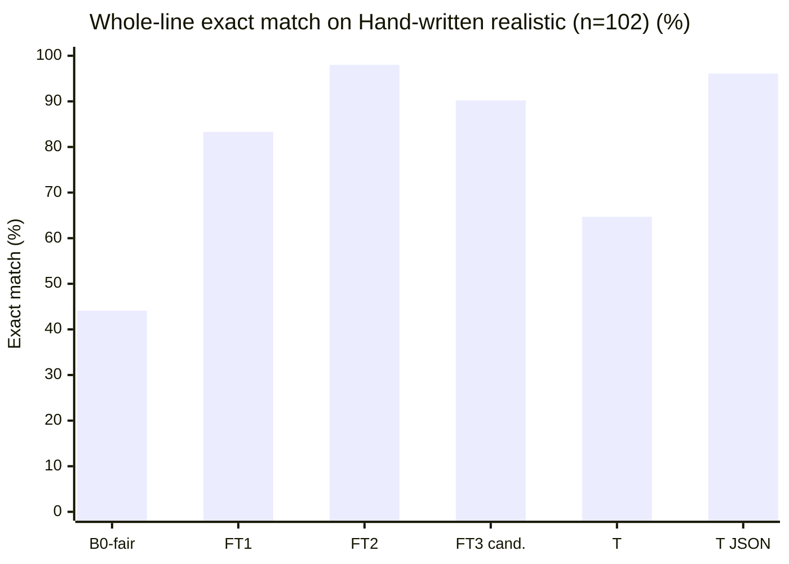
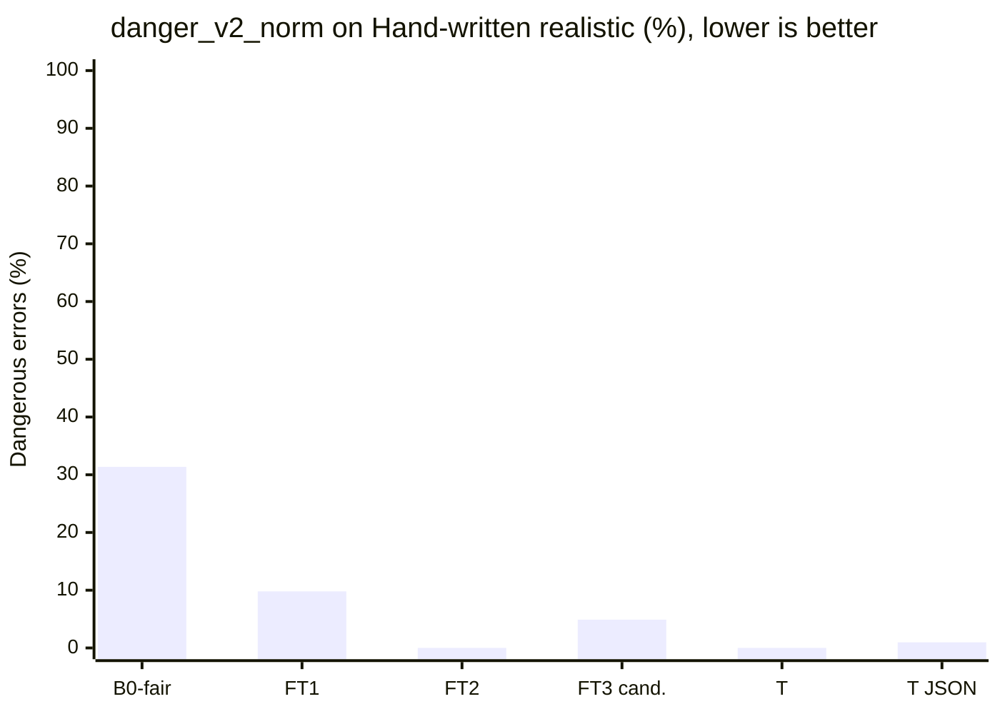
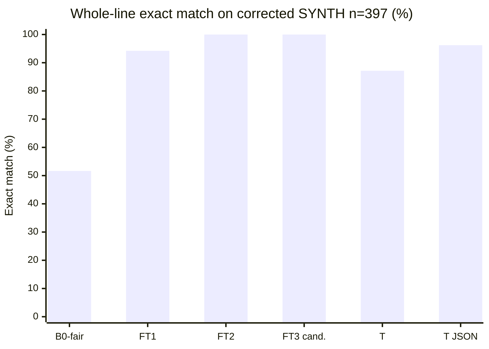
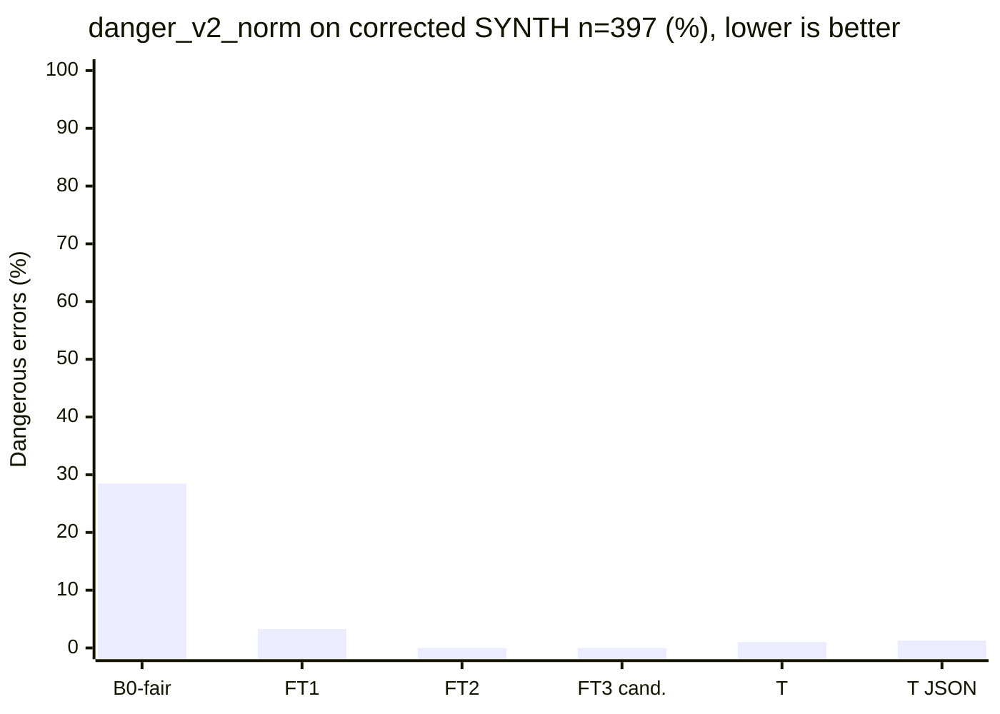

# Eval results

Numbers in this file come only from `eval/eval.py` runs saved under `eval/out/`. Values marked TODO have not been measured. Never invent numbers.

The photographed test set is **Public real-world set: HMR-100 (India), n=…** (optional **Public real-world set: BD-200 (Bangladesh)**). MIRAGE (arXiv 2410.09729) describes HMR-100 as simulated records written by doctors: the handwriting and notation are real; the patients are not. Never call it family data. At n≈100, 95% CIs are about ±8–9 points; only report model differences larger than that interval.

## What changed for FT2 (IDEA.md §8.6)

FT1 error buckets on the **old** synth_test (n=400, exact 0.80, danger 0.105): form 0.8875, dose 0.8925 (mostly unit), food 0.9125. Source: `eval/out/ft1_synth_test_old.json`. Root causes: Hindi/Marathi/Hinglish templates omitted form; doctor_short always said Tab; PRN gold.food was random while the line had no food token.

Fixes in the product and in v2 data:
- Every template style writes a form token; PRN gold.food is `any`.
- `copy_explicit` copies unique form/food/1/12 tokens from the line after Tinker parse, plus combo-brand suffixes, surface strength spans, insulin `N unit`, and Hindi/Hinglish time-slot words. It never invents a dose that is not written. Daily lines with no dose cue get ASK on dose+schedule.
- 500 targeted train rows (form/unit, food, half-tab, taper, PRN, ASK) mixed into 2000 mix rows → `data/synth/train.jsonl` n=2500 at git `5619cee` (this is what FT2 trained on). Later appends brought train to **3096** rows, all `renderer=template`.

**Comparability:** train/val/synth_test were regenerated with form-in-line. B0 / FT1 / FT2 below are scored on this **new** held-out synth_test (n=400, 38 held-out drugs). The old FT1 row (exact 0.80 on the old test) is a footnote, not the headline.

**Hand-written realistic (n=102)** is `data/heldout/handwritten_realistic.jsonl`, generated in code (`eval/handwritten_realistic.py` `SPECS`, `authored=code:eval/handwritten_realistic.py`), never handwritten by Vedant, never used in training. Gold is the dict next to each line in that file. These are de-identified typical clinic / caregiver slips (clinic print, doctor shorthand, WhatsApp, ASK). They are **not** photographed prescriptions. The set was created **after** FT2 was trained (`5619cee`). **67/102** lines use drug names seen in `data/synth/train.jsonl` (counted from those files).

**Public real-world set: HMR-100 (India)** is labelled on photographed public slips (`data/public/hmr100/`, gitignored; gold `data/public_labels/hmr100_gold.jsonl`). Scores stay TODO until a saved `eval/out/` run exists. Gemma 4 31B may see de-identified gold *text* only — never the images. Local OCR (`gemma4:e4b`) is **not claimed**: ollama is not on this laptop (`eval/ocr_cer.py`).

JSON-valid in the headline table is **corrected SYNTH** (n=397). Hand-written realistic json_valid is in its own section. **B0-fair** is the base-model baseline (same prompt as FT2, plus 3 few-shot examples and JSON-only instructions, same `_extract_json` parser). The old zero-shot B0 is a footnote.

**Scoring rules (every system):** `danger_v1` kept for continuity (dose/taper/duration/every_n_days/kind wrong **and** `needs_check` empty; parse_fail still sets danger_v1). `danger_v2` (default) is **normalised** drug/strength plus dose/taper/duration/every_n_days/kind wrong **and that field is not in `needs_check`**. `danger_v2_strict` skips drug/strength normalisation. Invalid JSON is `parse_fail`. Gemini HTTP 500/503 after retries is `http_fail`. Neither parse_fail nor http_fail is charted as danger. **Normalisation:** strength compared by number+unit; Devanagari→Latin `BRAND_ALIASES` in `pillclerk/normalize.py` (halant spellings `टेल्मा`, `पैन` were added after seeing errors).

**Gold correction (B2):** 14/`400` synth_test gold rows were aligned to the written line (food=`any` if no food word; duration matches `x Nd`; `prn_max` only if `max N` is written). Same lines. Backup: `data/synth/synth_test_gold_v1.jsonl`. Old scores: `eval/out/*_synth_test_gold_v1.json`. **3** exact train/synth_test duplicates dropped from scoring (`eval/out/overlap.json`, exact=3 unique lines).

**Train/val generator label bugs (not retrained):** `train.align_labels` re-ran `align_gold` on existing jsonl. Counts in `eval/out/train_label_bugs.json`: train 104/3096 changed (food 84, duration_days 7, prn_max_per_day 18); val 15/250 (food 8, prn_max_per_day 7). Generator already calls `align_gold` in `pair_row`; these were leftover on-disk labels. FT2/FT3 weights were **not** retrained.

`eval/out/payload_summary.json` is the committed per-run summary (count, sets, model, sha256) of the gitignored `eval/out/sent_payload_log.jsonl`. Official T is **no JSON mode**: `eval/out/gemma31_synth_test.json` n=397 and `eval/out/gemma31_handwritten_realistic.json` n=102. `gemma31_json` (responseMimeType + MedLine responseSchema) ran on the same two text sets (`eval/out/gemma31_json_synth_test.json`, `eval/out/gemma31_json_handwritten_realistic.json`).

**Parser rescore:** every official row below was rewritten through `extra_rules(copy_explicit)` from saved Tinker/Gemini preds (`rescored_from_preds` true). LoRA checkpoints and Gemini payloads are unchanged. No new SFT and no new Gemini calls.

| System | JSON valid | parse_fail | http_fail | Exact HW [95% CI] | Danger_v2_norm HW | Exact SYNTH n=397 [95% CI] | Danger_v2_norm SYNTH | Files |
|---|---|---|---|---|---|---|---|---|
| B0-fair Qwen3-8B base | 0.8060 | 0.1940 | 0.0 | 0.4412 [0.3431, 0.5392] | 0.3137 | 0.5164 [0.4660, 0.5642] | 0.2846 | `eval/out/b0_fair_synth_test.json` · `eval/out/b0_fair_handwritten_realistic.json` |
| B1 local OCR (gemma4:e4b) | not claimed | — | — | — | — | — | — | `eval/ocr_cer.py` (e4b not on this laptop) |
| FT1 Qwen3-8B + LoRA v1 | 0.9748 | 0.0252 | 0.0 | 0.8333 [0.7549, 0.9118] | 0.0980 | 0.9421 [0.9169, 0.9622] | 0.0327 | `eval/out/ft1_synth_test.json` · `eval/out/ft1_handwritten_realistic.json` |
| FT2 Qwen3-8B + LoRA v2 | 1.0 | 0.0 | 0.0 | 0.9804 [0.9510, 1.0] | 0.0 | 1.0 [1.0, 1.0] | 0.0 | `eval/out/ft2_synth_test.json` · `eval/out/ft2_handwritten_realistic.json` |
| T Gemma 4 31B (no JSON mode) | 0.8816 | 0.1083 | 0.0101 | 0.6471 [0.5490, 0.7451] | 0.0 | 0.8715 [0.8363, 0.9043] | 0.0101 | `eval/out/gemma31_synth_test.json` · `eval/out/gemma31_handwritten_realistic.json` |
| T JSON mode (`gemma31_json`) | 0.9950 | 0.0 | 0.0050 | 0.9608 [0.9216, 0.9902] | 0.0098 | 0.9622 [0.9421, 0.9798] | 0.0126 | `eval/out/gemma31_json_synth_test.json` · `eval/out/gemma31_json_handwritten_realistic.json` |
| FT3 Qwen3-8B + LoRA v3 (candidate, not applied) | 1.0 | 0.0 | 0.0 | 0.9020 [0.8431, 0.9608] | 0.0490 | 1.0 [1.0, 1.0] | 0.0 | `eval/out/ft3_synth_test.json` · `eval/out/ft3_handwritten_realistic.json` |

**T-valid exact** (lines where T produced valid JSON; `eval/out/t_valid.json`): SYNTH **346/350** vs FT2 **350/350**, McNemar 0 T-fixes / 4 T-regresses, p = 0.125. HW **66/70** vs FT2 **69/70**, 1/4, p = 0.375. Whole-set exact vs **no JSON mode** is a **schema-validity** gap (T parse_fail + http_fail). JSON mode closed that hole: SYNTH parse_fail 0.1083 → **0.0** (http_fail 0.0050, 2 Gemini HTTP failures); HW parse_fail 0.2745 → **0.0**, http_fail **0.0**, json_valid **1.0**. Paired FT2 vs `gemma31_json` exact: SYNTH **0** T-fixes / **15** T-regresses, p = 6.103515625e-05; HW **2** / **4**, p = 0.6875 (tie). Parser closed the remaining copyable FT2 misses (combo brand, insulin units, Hindi time slots, missing-frequency ASK). LoRA weights are the same. A fine-tuned 8B plus that parser beats JSON-mode 31B on corrected SYNTH and ties on hand-written realistic, at a quarter of the size, cheaper on Tinker (FT2 json_valid 1.0, parse_fail 0).

## SYNTH old vs corrected

Old gold, n=400, including 3 train duplicates. Sources: `eval/out/b0_fair_synth_test_gold_v1.json`, `eval/out/ft1_synth_test_gold_v1.json`, `eval/out/ft2_synth_test_gold_v1.json`.

| Field | B0-fair old | FT1 old | FT2 old |
|---|---|---|---|
| json_valid | 0.8025 | 0.97 | 1.0 |
| exact | 0.475 | 0.91 | 0.945 |
| exact_ci95 | [0.4275, 0.525] | [0.88, 0.9375] | [0.9225, 0.9675] |
| danger_v1 | 0.38 | 0.065 | 0.0025 |
| food | 0.785 | 0.96 | 0.97 |

Corrected gold, n=397 (3 exact train dups dropped). Sources: `eval/out/b0_fair_synth_test.json`, `eval/out/ft1_synth_test.json`, `eval/out/ft2_synth_test.json`, `eval/out/ft3_synth_test.json`, `eval/out/gemma31_synth_test.json`, `eval/out/gemma31_json_synth_test.json`. Strict exact and exact_norm are the same on this set.

| Field | B0-fair | FT1 | FT2 | FT3 candidate | T Gemma 31B (no JSON mode) | T JSON mode |
|---|---|---|---|---|---|---|
| json_valid | 0.8060 | 0.9748 | 1.0 | 1.0 | 0.8816 | 0.9950 |
| parse_fail | 0.1940 | 0.0252 | 0.0 | 0.0 | 0.1083 | 0.0 |
| http_fail | 0.0 | 0.0 | 0.0 | 0.0 | 0.0101 | 0.0050 |
| exact | 0.5164 | 0.9421 | 1.0 | 1.0 | 0.8715 | 0.9622 |
| exact_ci95 | [0.4660, 0.5642] | [0.9169, 0.9622] | [1.0, 1.0] | [1.0, 1.0] | [0.8363, 0.9043] | [0.9421, 0.9798] |
| exact_norm | 0.5164 | 0.9421 | 1.0 | 1.0 | 0.8715 | 0.9622 |
| exact_on_valid | 0.6406 | 0.9664 | 1.0 | 1.0 | 0.9886 | 0.9671 |
| n_valid | 320 | 387 | 397 | 397 | 350 | 395 |
| danger_v1 | 0.3728 | 0.0579 | 0.0 | 0.0 | 0.1108 | 0.0025 |
| danger_v2 (norm) | 0.2846 | 0.0327 | 0.0 | 0.0 | 0.0101 | 0.0126 |
| danger_v2_strict | 0.2846 | 0.0327 | 0.0 | 0.0 | 0.0101 | 0.0126 |
| ask_recall | 0.5882 | 0.0588 | 0.7059 | 0.9412 | 0.8235 | 0.9412 |
| false_ask_rate | 0.1737 | 0.0 | 0.0 | 0.0 | 0.2737 | 0.1737 |
| n_gold_ask | 17 | 17 | 17 | 17 | 17 | 17 |
| drug | 0.8035 | 0.9748 | 1.0 | 1.0 | 0.8766 | 0.9874 |
| strength | 0.7254 | 0.9748 | 1.0 | 1.0 | 0.8816 | 0.9924 |
| form | 0.8060 | 0.9748 | 1.0 | 1.0 | 0.8816 | 0.9950 |
| kind | 0.7909 | 0.9673 | 1.0 | 1.0 | 0.8791 | 0.9950 |
| dose | 0.5869 | 0.9748 | 1.0 | 1.0 | 0.8741 | 0.9673 |
| every_n_days | 0.7960 | 0.9748 | 1.0 | 1.0 | 0.8816 | 0.9950 |
| taper | 0.7909 | 0.9748 | 1.0 | 1.0 | 0.8816 | 0.9950 |
| food | 0.8060 | 0.9748 | 1.0 | 1.0 | 0.8816 | 0.9950 |
| duration_days | 0.7783 | 0.9446 | 1.0 | 1.0 | 0.8816 | 0.9899 |
| prn_max_per_day | 0.8060 | 0.9723 | 1.0 | 1.0 | 0.8816 | 0.9950 |

p50/p95 s/line (from the original Tinker run, copied on rescore): B0-fair 3.20 / 3.30 · FT1 2.18 / 3.18 · FT2 3.16 / 3.91 · FT3 3.12 / 3.57. **T API p50/p95 36.55 / 90.49 includes retries** on HTTP 429/500/503 (`eval/out/gemma31_synth_test.json`). T JSON mode p50/p95 **40.80 / 124.34** (`eval/out/gemma31_json_synth_test.json`). Do not compare T latency to Tinker without that label.

## Paired FT1 vs FT2 (corrected SYNTH, n=397)

McNemar on exact: **23** FT2-correct / FT1-wrong, **0** FT1-correct / FT2-wrong, exact two-sided p = 2.384185791015625e-07 (`eval/report.py` `mcnemar_p_two_sided`). Sources: `eval/out/ft1_synth_test_preds.jsonl`, `eval/out/ft2_synth_test_preds.jsonl`.

Paired FT2 vs FT3 on the same 397 lines: **0** fixes, **0** regressions, p = 1.0. Both 397/397 exact after the parser rescore. ASK recall 0.7059 → 0.9412. Sources: `eval/out/ft2_synth_test_preds.jsonl`, `eval/out/ft3_synth_test_preds.jsonl`.

Paired FT2 vs T on the same 397 lines (whole set, **no JSON mode**): **0** T-correct / FT2-wrong, **51** FT2-correct / T-wrong, p = 8.881784197001252e-16. That 51 is almost all T `parse_fail` (0.1083) plus `http_fail` (0.0101, 4 Gemini HTTP 500). On **T-valid** lines only: T 346/350, FT2 350/350, McNemar 0/4, p = 0.125 (`eval/out/t_valid.json`). danger_v2_norm count 0 → 4. Source: `eval/out/gemma31_synth_test_preds.jsonl`.

Paired FT2 vs `gemma31_json` on the same 397 lines: **0** T-correct / FT2-wrong, **15** FT2-correct / T-wrong, p = 6.103515625e-05. json_valid 0.9950, parse_fail 0.0, http_fail 0.0050. On JSON-mode-valid lines: T 382/395, FT2 395/395, McNemar 0/13, p = 0.000244140625. danger_v2_norm count 0 → 5. Source: `eval/out/gemma31_json_synth_test_preds.jsonl`.

## B0 footnote (why the old baseline scored 0.0)

The original B0 used SYSTEM_PROMPT + the line, no few-shot, no enum/dose-object reminder. It **does** emit JSON-shaped text (spot-check: Glycomet line, 165 chars) and fails `MedLine` on every line: `form="TAB"`, `dose="1-0-1"` as a string, `food="AFTER FOOD"`, `kind="regular"`. `json_valid` 0.0 is schema validity, not empty output. Sources: `eval/out/b0_synth_test.json`, `eval/out/b0_handwritten_realistic.json`.

**B0-fair** keeps the same Tinker base Qwen3-8B and the same `_extract_json` + `copy_explicit` parser, and adds (1) the FT2 system prompt, (2) JSON-only / enum / dose-object instructions, (3) 3 few-shot gold pairs from train, none of which appear in either eval set. Corrected SYNTH json_valid 0.8060, exact 0.5164 (`eval/out/b0_fair_synth_test.json`). Hand-written realistic json_valid 0.7549, exact 0.4412. Remaining misses are mostly dose (object slots) and strength. The LoRA lifts exact match 0.5164 → 1.0 on corrected SYNTH and 0.4412 → 0.9804 on hand-written realistic. FT2's whole-set edge over **no-JSON-mode** T is a **schema-validity** win; on T-valid SYNTH lines p = 0.125. Against JSON-mode T, FT2 wins on SYNTH (p = 6.103515625e-05) and ties on HW (p = 0.6875).

## FT2 remaining SYNTH misses (corrected, n=397)

0 inexact lines (397/397 exact, all per_field 1.0). Parser `copy_explicit` copied the held-out combo brand **Telma AM** and the remaining surface/dose tokens. LoRA weights are unchanged. danger_v2_norm = 0. Source: `eval/out/ft2_synth_test.json`.

## Footnote: old synth_test (pre form-in-line)

FT1 on the previous 400-line file, after `0` vs `0.0` rescore: json_valid 0.99, exact 0.80 [0.76, 0.84], danger 0.105, form 0.8875, dose 0.8925, food 0.9125, p50 2.17 s. Saved as `eval/out/ft1_synth_test_old.json`.

## Hand-written realistic (n=102, never trained, not photographed)

Scored with `eval/eval.py` on `data/heldout/handwritten_realistic.jsonl`. Sources: `eval/out/b0_fair_handwritten_realistic.json`, `eval/out/ft1_handwritten_realistic.json`, `eval/out/ft2_handwritten_realistic.json`, `eval/out/ft3_handwritten_realistic.json`, `eval/out/gemma31_handwritten_realistic.json`, `eval/out/gemma31_json_handwritten_realistic.json`. **Hand-written realistic is the FT3 dev set**, not the keep-rule test.

| Field | B0-fair | FT1 | FT2 | FT3 candidate | T Gemma 31B (no JSON mode) | T JSON mode |
|---|---|---|---|---|---|---|
| json_valid | 0.7549 | 0.9412 | 0.9902 | 0.9706 | 0.6863 | 1.0 |
| parse_fail | 0.2451 | 0.0588 | 0.0098 | 0.0294 | 0.2745 | 0.0 |
| http_fail | 0.0 | 0.0 | 0.0 | 0.0 | 0.0392 | 0.0 |
| exact | 0.4412 | 0.8333 | 0.9804 | 0.9020 | 0.6471 | 0.9608 |
| exact_norm | 0.4412 | 0.8333 | 0.9804 | 0.9020 | 0.6471 | 0.9608 |
| exact_on_valid | 0.5844 | 0.8854 | 0.9901 | 0.9293 | 0.9429 | 0.9608 |
| n_valid | 77 | 96 | 101 | 99 | 70 | 102 |
| danger_v1 | 0.4412 | 0.1471 | 0.0098 | 0.0686 | 0.2745 | 0.0 |
| danger_v2 (norm) | 0.3137 | 0.0980 | 0.0 | 0.0490 | 0.0 | 0.0098 |
| danger_v2_strict | 0.3137 | 0.0980 | 0.0 | 0.0490 | 0.0 | 0.0098 |
| ask_recall | 0.8 | 0.2 | 1.0 | 1.0 | 0.6 | 1.0 |
| false_ask_rate | 0.1546 | 0.0 | 0.0 | 0.0206 | 0.2990 | 0.3608 |
| n_gold_ask | 5 | 5 | 5 | 5 | 5 | 5 |
| drug | 0.7451 | 0.9216 | 0.9902 | 0.9706 | 0.6863 | 0.9902 |
| strength | 0.6765 | 0.9412 | 0.9902 | 0.9510 | 0.6863 | 0.9804 |
| form | 0.7255 | 0.9216 | 0.9804 | 0.9216 | 0.6471 | 0.9804 |
| kind | 0.7549 | 0.9412 | 0.9902 | 0.9706 | 0.6863 | 1.0 |
| dose | 0.5490 | 0.9216 | 0.9902 | 0.9216 | 0.6667 | 0.9804 |
| every_n_days | 0.7451 | 0.9216 | 0.9902 | 0.9706 | 0.6863 | 1.0 |
| taper | 0.7549 | 0.9412 | 0.9902 | 0.9706 | 0.6863 | 1.0 |
| food | 0.7549 | 0.9412 | 0.9902 | 0.9706 | 0.6863 | 1.0 |
| duration_days | 0.7255 | 0.8725 | 0.9902 | 0.9608 | 0.6863 | 1.0 |
| prn_max_per_day | 0.7549 | 0.9314 | 0.9902 | 0.9706 | 0.6863 | 1.0 |

T API p50/p95 40.77 / 115.02 **includes retries**. T JSON mode p50/p95 **43.05 / 108.27**. Tinker p50 (original run): B0-fair 3.13 · FT1 2.22 · FT2 3.20 · FT3 2.76.

Paired FT2 vs FT1 on the same 102 lines: **17** exact-match fixes, **2** regressions, exact two-sided McNemar p = 0.000728607177734375. Sources: `eval/out/ft1_handwritten_realistic_preds.jsonl`, `eval/out/ft2_handwritten_realistic_preds.jsonl`.

Paired FT2 vs FT3 (dev): **1** FT3-correct / FT2-wrong, **9** FT2-correct / FT3-wrong, p = 0.021484375. danger_v2_norm count 0 → 5. danger_v1 rate 0.0098 → 0.0686. Sources: `eval/out/ft2_handwritten_realistic_preds.jsonl`, `eval/out/ft3_handwritten_realistic_preds.jsonl`. Line-level review: `eval/danger_review.md`.

Paired FT2 vs T (whole set, **no JSON mode**): **1** T-correct / FT2-wrong, **35** FT2-correct / T-wrong, p = 1.076841726899147e-09. On **T-valid** lines: **66/70** vs **69/70**, p = 0.375 (`eval/out/t_valid.json`). T `parse_fail` 0.2745 and `http_fail` 0.0392 (3 HTTP 500, 1 HTTP 503). danger_v2_norm count 0 = 0.

Paired FT2 vs `gemma31_json` on the same 102 lines: **2** T-correct / FT2-wrong, **4** FT2-correct / T-wrong, p = 0.6875 (tie). json_valid 1.0, parse_fail 0.0, http_fail 0.0, exact 0.9608 [0.9216, 0.9902] vs FT2 0.9804 [0.9510, 1.0]. danger_v2_norm count 0 → 1. Source: `eval/out/gemma31_json_handwritten_realistic_preds.jsonl`.

**Authorship:** lines were generated in code (`eval/handwritten_realistic.py`), not handwritten by Vedant. Created after FT2 (`5619cee`). **67/102** lines use drug names seen in `data/synth/train.jsonl`.

FT2 remaining misses: 2 inexact lines. `डोलो 650 जरूरत पर` (form `cap` vs gold `tab`; no form cue on the line). `Duphalac 15ml subah 15ml raat khane ke baad 7 din` (`parse_fail` / pred None). Combo brand, insulin units, Hindi three-slot, and missing-frequency ASK are closed by the parser. Source: `eval/out/ft2_handwritten_realistic.json`.

**Limits:** no second labeller, photographed originals stay gitignored (HMR CC BY-ND 4.0), gold for this set is the in-file dict next to each generated line.

## Public real-world set: HMR-100 (India), n=…

Not scored yet. Gold is empty until labelled on the Label REAL page (first 30 HMR pages, pre-filled names, A/N/B/P, labelled/100). After ~100 lines, `scripts/run_hmr_eval_if_ready.py` runs:

```
uv run python -m eval.eval --system b0_fair --set data/public_labels/hmr100_gold.jsonl
uv run python -m eval.eval --system ft2 --set data/public_labels/hmr100_gold.jsonl
uv run python -m eval.eval --system ft3 --set data/public_labels/hmr100_gold.jsonl
uv run python -m eval.eval --system gemma31_json --set data/public_labels/hmr100_gold.jsonl --workers 3
```

`gemma31_json` on HMR is approved once n≥100. Official T stays `gemma31` (no JSON mode).

**FT3 keep-rule (not met):** keep v3 only if exact is up on SYNTH **and** HMR with McNemar p<0.05 and **normalised danger_v2 is not up**. SYNTH exact is tied (0/0, p=1.0, both 1.0 after the parser); HMR gold is empty (n=0). On the HW **dev** set FT3 is behind (1/9, p=0.021484375) and danger_v2_norm is up (0 → 0.0490). `.env` `PILLCLERK_TINKER_PATH` stays on v2. Checkpoint `train/checkpoint_v3.json` (n_train=3296, extra `targeted_ft3_danger.jsonl`) and loss log `train/ft3_sft.log` are kept as a candidate. Training: val_nll 1.7098 → 0.0018 (step 610/618). Optional BD-200 (~40 lines) is a notation stress test (`1+0+1`, Bangla durations), not the headline n.

At n≈100, only report model differences larger than the 95% CI (about ±8–9 points).

Extra synthetic form/dose/food stress: 400 rows in `data/synth/targeted_form_dose_food.jsonl`, 396 unique lines appended, then 200 drug/strength rows. **`train.jsonl` n=3096** (`data/synth/train.jsonl`). FT2 weights were trained on the 2500-row mix at `5619cee`.








