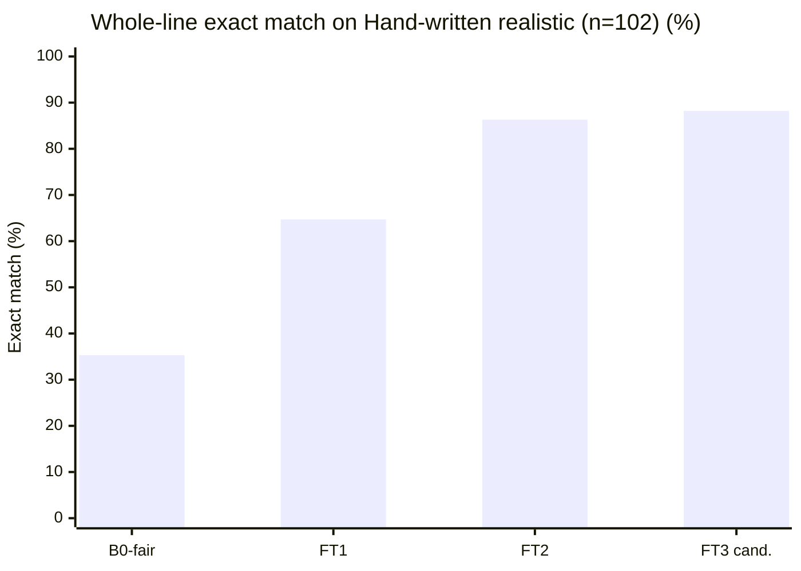
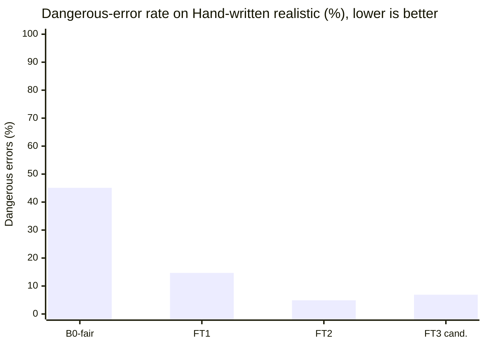
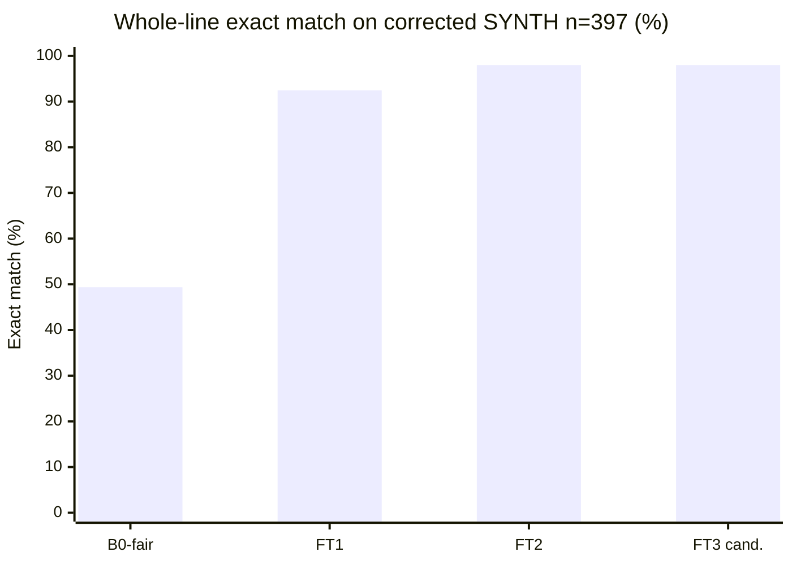
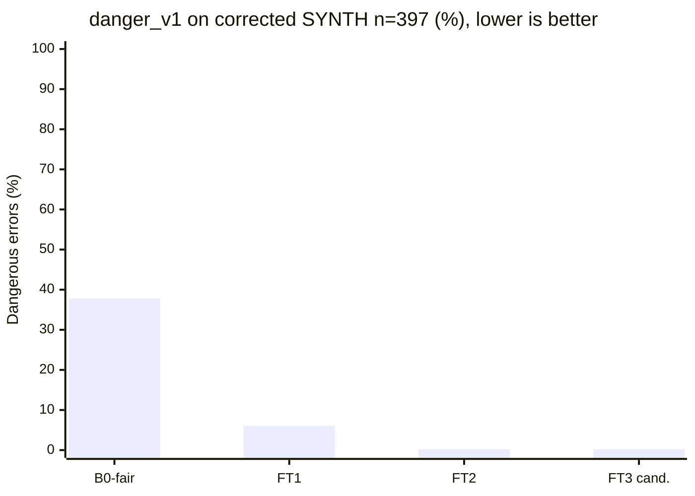

# Eval results

Numbers in this file come only from `eval/eval.py` runs saved under `eval/out/`. Values marked TODO have not been measured. Never invent numbers.

The photographed test set is **Public real-world set: HMR-100 (India), n=…** (optional **Public real-world set: BD-200 (Bangladesh)**). MIRAGE (arXiv 2410.09729) describes HMR-100 as simulated records written by doctors: the handwriting and notation are real; the patients are not. Never call it family data. At n≈100, 95% CIs are about ±8–9 points; only report model differences larger than that interval.

## What changed for FT2 (IDEA.md §8.6)

FT1 error buckets on the **old** synth_test (n=400, exact 0.80, danger 0.105): form 0.8875, dose 0.8925 (mostly unit), food 0.9125. Source: `eval/out/ft1_synth_test_old.json`. Root causes: Hindi/Marathi/Hinglish templates omitted form; doctor_short always said Tab; PRN gold.food was random while the line had no food token.

Fixes in the product and in v2 data:
- Every template style writes a form token; PRN gold.food is `any`.
- `copy_explicit` copies unique form/food/1/12 tokens from the line after Tinker parse. It never invents dose slots.
- 500 targeted train rows (form/unit, food, half-tab, taper, PRN, ASK) mixed into 2000 mix rows → `data/synth/train.jsonl` n=2500 at git `5619cee` (this is what FT2 trained on). Later appends brought train to **3096** rows, all `renderer=template`.

**Comparability:** train/val/synth_test were regenerated with form-in-line. B0 / FT1 / FT2 below are scored on this **new** held-out synth_test (n=400, 38 held-out drugs). The old FT1 row (exact 0.80 on the old test) is a footnote, not the headline.

**Hand-written realistic (n=102)** is `data/heldout/handwritten_realistic.jsonl`, authored by Vedant, never used in training. Gold is typed against the written line. These are de-identified typical clinic / caregiver slips (clinic print, doctor shorthand, WhatsApp, ASK). They are **not** photographed prescriptions. The set was created **after** FT2 was trained (`5619cee`). **67/102** lines use drug names seen in `data/synth/train.jsonl` (counted from those files).

**Public real-world set: HMR-100 (India)** is labelled on photographed public slips (`data/public/hmr100/`, gitignored; gold `data/public_labels/hmr100_gold.jsonl`). Scores stay TODO until a saved `eval/out/` run exists. Gemma 4 31B may see de-identified gold *text* only — never the images. Local OCR (`gemma4:e4b`) is **not claimed**: ollama is not on this laptop (`eval/ocr_cer.py`).

JSON-valid in the headline table is **corrected SYNTH** (n=397). Hand-written realistic json_valid is in its own section. **B0-fair** is the base-model baseline (same prompt as FT2, plus 3 few-shot examples and JSON-only instructions, same `_extract_json` parser). The old zero-shot B0 is a footnote.

**Scoring rules (every system):** `danger_v1` kept for continuity (dose/taper/duration/every_n_days/kind wrong **and** `needs_check` empty). `danger_v2` counts a line dangerous when drug, strength, dose, taper, duration_days, every_n_days or kind is wrong **and that field is not in `needs_check`** (`kind`/`taper`/`every_n_days` map to `schedule`). Invalid JSON is `parse_fail`, not `danger_v2`. **Normalisation** (reported next to strict exact): strength compared by number+unit; Devanagari→Latin `BRAND_ALIASES` in `pillclerk/normalize.py`.

**Gold correction (B2):** 14/`400` synth_test gold rows were aligned to the written line (food=`any` if no food word; duration matches `x Nd`; `prn_max` only if `max N` is written). Same lines. Backup: `data/synth/synth_test_gold_v1.jsonl`. Old scores: `eval/out/*_synth_test_gold_v1.json`. **3** exact train/synth_test duplicates dropped from scoring (`eval/out/overlap.json`, exact=3 unique lines).

`eval/out/payload_summary.json` is the committed per-run summary (count, sets, model, sha256) of the gitignored `eval/out/sent_payload_log.jsonl`. It is not the official Gemma 31B T-row.

| System | JSON valid | Exact HW [95% CI] | Danger_v1 HW | Exact SYNTH corrected n=397 [95% CI] | Danger_v1 SYNTH | Danger_v2 SYNTH | p50 s/line | Files |
|---|---|---|---|---|---|---|---|---|
| B0-fair Qwen3-8B base | 0.8060 | 0.3529 [0.2549, 0.4510] | 0.4510 | 0.4937 [0.4458, 0.5416] | 0.3778 | 0.3073 | 3.20 | `eval/out/b0_fair_synth_test.json` · `eval/out/b0_fair_handwritten_realistic.json` |
| B1 local OCR (gemma4:e4b) | not claimed | — | — | — | — | — | — | `eval/ocr_cer.py` (e4b not on this laptop) |
| FT1 Qwen3-8B + LoRA v1 | 0.9748 | 0.6471 [0.5588, 0.7451] | 0.1471 | 0.9244 [0.8967, 0.9496] | 0.0605 | 0.0504 | 2.18 | `eval/out/ft1_synth_test.json` · `eval/out/ft1_handwritten_realistic.json` |
| FT2 Qwen3-8B + LoRA v2 | 1.0 | 0.8627 [0.7941, 0.9314] | 0.0490 | 0.9798 [0.9647, 0.9924] | 0.0025 | 0.0202 | 3.16 | `eval/out/ft2_synth_test.json` · `eval/out/ft2_handwritten_realistic.json` |
| T Gemma 4 31B (AI Studio) | TODO | TODO | TODO | TODO | TODO | TODO | n/a (API) | — |
| FT3 Qwen3-8B + LoRA v3 (candidate, not applied) | 1.0 | 0.8824 [0.8235, 0.9412] | 0.0686 | 0.9798 [0.9647, 0.9924] | 0.0025 | 0.0202 | 3.12 | `eval/out/ft3_synth_test.json` · `eval/out/ft3_handwritten_realistic.json` |

## SYNTH old vs corrected

Old gold, n=400, including 3 train duplicates. Sources: `eval/out/b0_fair_synth_test_gold_v1.json`, `eval/out/ft1_synth_test_gold_v1.json`, `eval/out/ft2_synth_test_gold_v1.json`.

| Field | B0-fair old | FT1 old | FT2 old |
|---|---|---|---|
| json_valid | 0.8025 | 0.97 | 1.0 |
| exact | 0.475 | 0.91 | 0.945 |
| exact_ci95 | [0.4275, 0.525] | [0.88, 0.9375] | [0.9225, 0.9675] |
| danger_v1 | 0.38 | 0.065 | 0.0025 |
| food | 0.785 | 0.96 | 0.97 |

Corrected gold, n=397 (3 exact train dups dropped). Sources: `eval/out/b0_fair_synth_test.json`, `eval/out/ft1_synth_test.json`, `eval/out/ft2_synth_test.json`. Strict exact and exact_norm are the same on this set.

| Field | B0-fair | FT1 | FT2 | FT3 candidate |
|---|---|---|---|---|
| json_valid | 0.8060 | 0.9748 | 1.0 | 1.0 |
| parse_fail | 0.1940 | 0.0252 | 0.0 | 0.0 |
| exact | 0.4937 | 0.9244 | 0.9798 | 0.9798 |
| exact_ci95 | [0.4458, 0.5416] | [0.8967, 0.9496] | [0.9647, 0.9924] | [0.9647, 0.9924] |
| exact_norm | 0.4937 | 0.9244 | 0.9798 | 0.9798 |
| danger_v1 | 0.3778 | 0.0605 | 0.0025 | 0.0025 |
| danger_v2 | 0.3073 | 0.0504 | 0.0202 | 0.0202 |
| ask_recall | 0.5294 | 0.0588 | 0.7059 | 0.9412 |
| false_ask_rate | 0.1737 | 0.0 | 0.0 | 0.0 |
| n_gold_ask | 17 | 17 | 17 | 17 |
| drug | 0.7834 | 0.9572 | 0.9798 | 0.9798 |
| strength | 0.7254 | 0.9748 | 1.0 | 1.0 |
| form | 0.8060 | 0.9748 | 1.0 | 1.0 |
| kind | 0.7909 | 0.9673 | 1.0 | 1.0 |
| dose | 0.5793 | 0.9723 | 0.9975 | 0.9975 |
| every_n_days | 0.7960 | 0.9748 | 1.0 | 1.0 |
| taper | 0.7909 | 0.9748 | 1.0 | 1.0 |
| food | 0.8060 | 0.9748 | 1.0 | 1.0 |
| duration_days | 0.7783 | 0.9446 | 1.0 | 1.0 |
| prn_max_per_day | 0.8060 | 0.9723 | 1.0 | 1.0 |

p50/p95 s/line (from the original Tinker run, copied on rescore): B0-fair 3.20 / 3.30 · FT1 2.18 / 3.18 · FT2 3.16 / 3.91 · FT3 3.12 / 3.57 (`eval/out/ft3_synth_test.json`).

## Paired FT1 vs FT2 (corrected SYNTH, n=397)

McNemar on exact: **22** FT2-correct / FT1-wrong, **0** FT1-correct / FT2-wrong, exact two-sided p = 4.76837158203125e-07 (`eval/report.py` `mcnemar_p_two_sided`). Sources: `eval/out/ft1_synth_test_preds.jsonl`, `eval/out/ft2_synth_test_preds.jsonl`.

Paired FT2 vs FT3 on the same 397 lines: **0** fixes, **0** regressions, p = 1.0. Same 8 inexact lines (held-out **Telma AM**). danger_v2 count 8 = 8. ASK recall 0.7059 → 0.9412. Sources: `eval/out/ft2_synth_test_preds.jsonl`, `eval/out/ft3_synth_test_preds.jsonl`.

## B0 footnote (why the old baseline scored 0.0)

The original B0 used SYSTEM_PROMPT + the line, no few-shot, no enum/dose-object reminder. It **does** emit JSON-shaped text (spot-check: Glycomet line, 165 chars) and fails `MedLine` on every line: `form="TAB"`, `dose="1-0-1"` as a string, `food="AFTER FOOD"`, `kind="regular"`. `json_valid` 0.0 is schema validity, not empty output. Sources: `eval/out/b0_synth_test.json`, `eval/out/b0_handwritten_realistic.json`.

**B0-fair** keeps the same Tinker base Qwen3-8B and the same `_extract_json` + `copy_explicit` parser, and adds (1) the FT2 system prompt, (2) JSON-only / enum / dose-object instructions, (3) 3 few-shot gold pairs from train, none of which appear in either eval set. Corrected SYNTH json_valid 0.8060, exact 0.4937 (`eval/out/b0_fair_synth_test.json`). Hand-written realistic json_valid 0.7549, exact 0.3529. Remaining misses are mostly dose (object slots) and strength. The LoRA lifts exact match 0.4937 → 0.9798 on corrected SYNTH and 0.3529 → 0.8627 on hand-written realistic.

## FT2 remaining SYNTH misses (corrected, n=397)

8 inexact lines, all `drug` (held-out combo brand **Telma AM**). 1 dose miss. Food is 1.0 after gold alignment (the previous 12 food misses were gold bugs: no food word on the line, gold still carried a random food). danger_v1 = 0.0025 (1 line). danger_v2 = 0.0202 because unflagged wrong `drug` now counts. Source: `eval/out/ft2_synth_test.json`.

## Footnote: old synth_test (pre form-in-line)

FT1 on the previous 400-line file, after `0` vs `0.0` rescore: json_valid 0.99, exact 0.80 [0.76, 0.84], danger 0.105, form 0.8875, dose 0.8925, food 0.9125, p50 2.17 s. Saved as `eval/out/ft1_synth_test_old.json`.

## Hand-written realistic (n=102, never trained, not photographed)

Scored with `eval/eval.py` on `data/heldout/handwritten_realistic.jsonl`. Sources: `eval/out/b0_fair_handwritten_realistic.json`, `eval/out/ft1_handwritten_realistic.json`, `eval/out/ft2_handwritten_realistic.json`, `eval/out/ft3_handwritten_realistic.json`. **Hand-written realistic is the FT3 dev set**, not the keep-rule test.

| Field | B0-fair | FT1 | FT2 | FT3 candidate |
|---|---|---|---|---|
| json_valid | 0.7549 | 0.9412 | 0.9902 | 0.9706 |
| parse_fail | 0.2451 | 0.0588 | 0.0098 | 0.0294 |
| exact | 0.3529 | 0.6471 | 0.8627 | 0.8824 |
| exact_norm | 0.4118 | 0.8039 | 0.9020 | 0.8922 |
| danger_v1 | 0.4510 | 0.1471 | 0.0490 | 0.0686 |
| danger_v2 | 0.4020 | 0.2843 | 0.1275 | 0.0686 |
| ask_recall | 0.6 | 0.2 | 0.8 | 1.0 |
| false_ask_rate | 0.1546 | 0.0 | 0.0 | 0.0206 |
| n_gold_ask | 5 | 5 | 5 | 5 |
| drug | 0.7255 | 0.8824 | 0.9314 | 0.9412 |
| strength | 0.5588 | 0.7255 | 0.9216 | 0.9510 |
| form | 0.7255 | 0.9216 | 0.9706 | 0.9216 |
| kind | 0.7549 | 0.9412 | 0.9902 | 0.9706 |
| dose | 0.5294 | 0.9118 | 0.9510 | 0.9216 |
| every_n_days | 0.7451 | 0.9216 | 0.9902 | 0.9706 |
| taper | 0.7549 | 0.9412 | 0.9902 | 0.9706 |
| food | 0.7549 | 0.9412 | 0.9902 | 0.9706 |
| duration_days | 0.7255 | 0.8725 | 0.9902 | 0.9608 |
| prn_max_per_day | 0.7451 | 0.9216 | 0.9902 | 0.9608 |

p50 s/line: B0-fair 3.13 · FT1 2.22 · FT2 3.20 · FT3 2.76. p95: B0-fair 3.32 · FT1 3.48 · FT2 4.22 · FT3 3.79.

Paired FT2 vs FT1 on the same 102 lines: **25** exact-match fixes, **3** regressions, exact two-sided McNemar p = 2.744048833847046e-05. Dangerous errors (v1): 15 → 5. Sources: `eval/out/ft1_handwritten_realistic_preds.jsonl`, `eval/out/ft2_handwritten_realistic_preds.jsonl`.

Paired FT2 vs FT3 (dev): **8** exact-match fixes, **6** regressions, p = 0.79052734375. danger_v2 count 13 → 7. danger_v1 rate 0.0490 → 0.0686. Sources: `eval/out/ft2_handwritten_realistic_preds.jsonl`, `eval/out/ft3_handwritten_realistic_preds.jsonl`.

**Authorship:** Vedant typed gold against each written line. Created after FT2 (`5619cee`). **67/102** lines use drug names seen in `data/synth/train.jsonl`.

FT2 remaining misses: 14 inexact lines. Error-field counts: strength 8, drug 7, dose 5, form 3. Hindi/Marathi Devanagari brand names vs Latin gold, combo brands, and insulin units are the main buckets. Food is 0.990 (1 miss).

**Limits:** no second labeller, photographed originals stay gitignored (HMR CC BY-ND 4.0), one author types gold.

## Public real-world set: HMR-100 (India), n=…

Not scored yet. Gold is empty until labelled on the Label REAL page. After ~100 lines (~30 pages):

```
uv run python -m eval.eval --system b0_fair --set data/public_labels/hmr100_gold.jsonl
uv run python -m eval.eval --system ft2 --set data/public_labels/hmr100_gold.jsonl
uv run python -m eval.eval --system ft3 --set data/public_labels/hmr100_gold.jsonl
uv run python -m eval.eval --system gemma31 --set data/public_labels/hmr100_gold.jsonl --workers 3
```

**FT3 keep-rule (not met):** keep v3 only if exact is up on SYNTH **and** HMR with McNemar p<0.05 and danger_v2 is not up. SYNTH exact is tied (0/0, p=1.0); HMR gold is empty (n=0). `.env` `PILLCLERK_TINKER_PATH` stays on v2. Checkpoint `train/checkpoint_v3.json` (n_train=3296, extra `targeted_ft3_danger.jsonl`) and loss log `train/ft3_sft.log` are kept as a candidate. Training: val_nll 1.7098 → 0.0018 (step 610/618). Optional BD-200 (~40 lines) is a notation stress test (`1+0+1`, Bangla durations), not the headline n.

At n≈100, only report model differences larger than the 95% CI (about ±8–9 points).

Extra synthetic form/dose/food stress: 400 rows in `data/synth/targeted_form_dose_food.jsonl`, 396 unique lines appended, then 200 drug/strength rows. **`train.jsonl` n=3096** (`data/synth/train.jsonl`). FT2 weights were trained on the 2500-row mix at `5619cee`.








