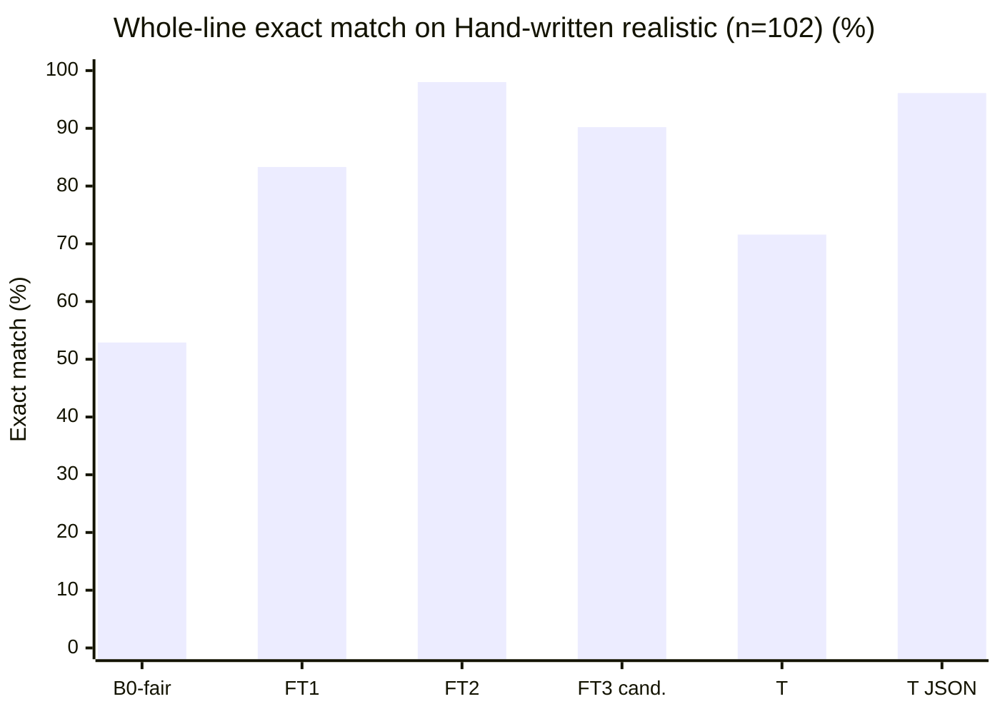
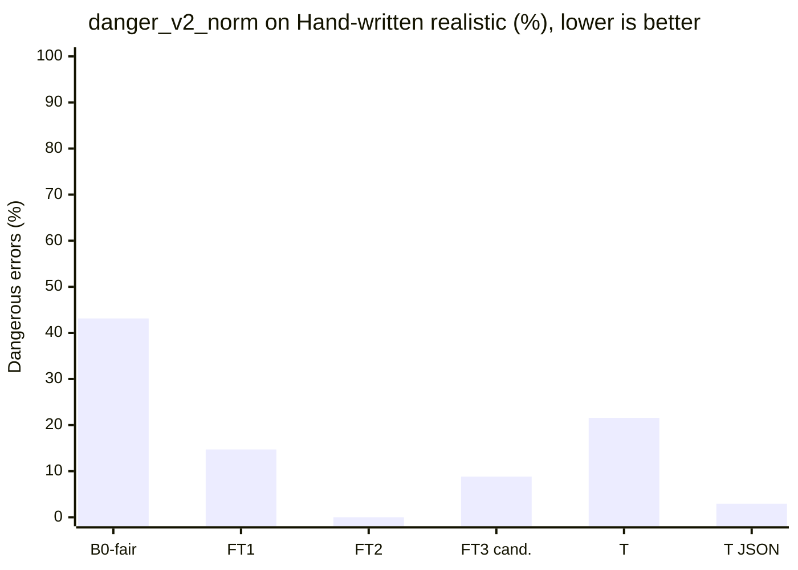
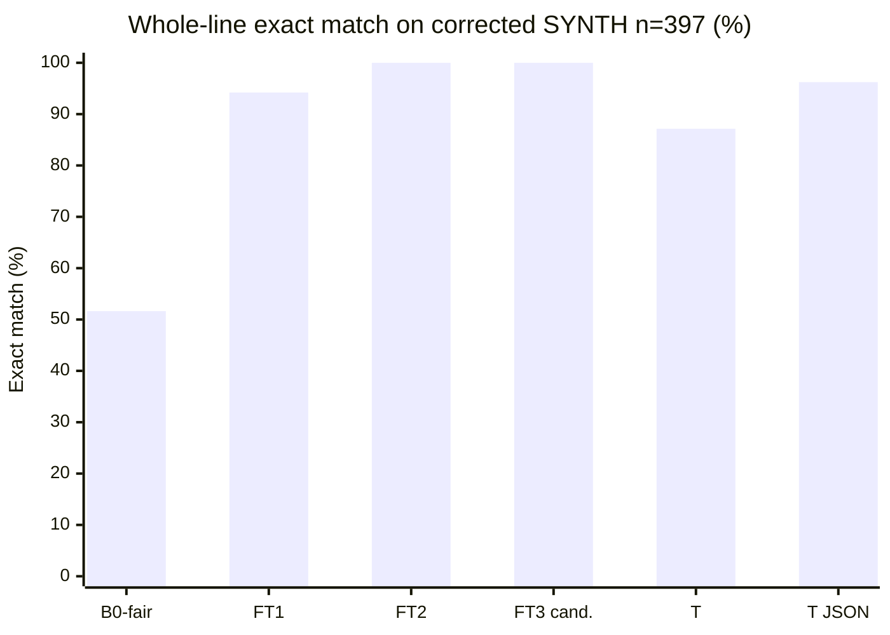
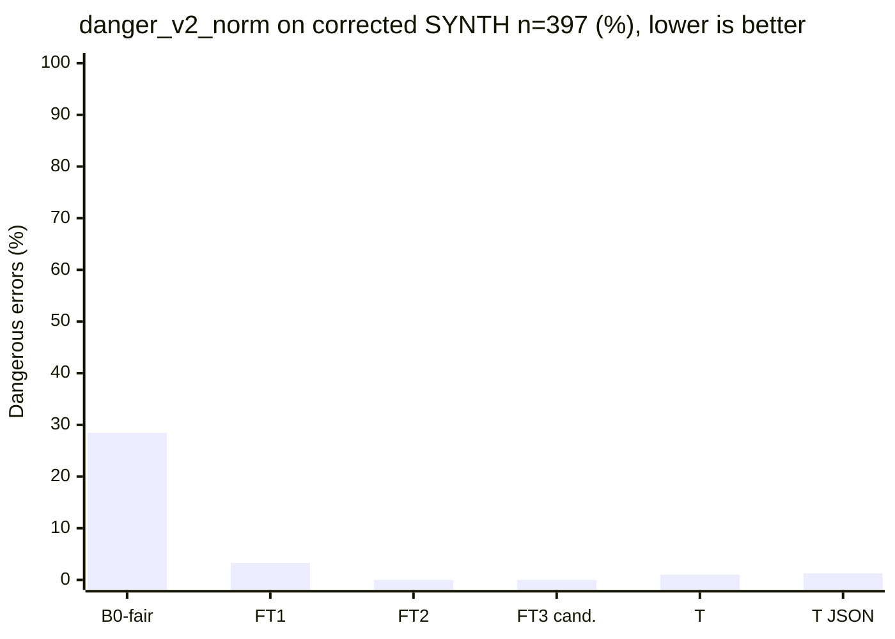

# Eval results

Numbers in this file come only from `eval/eval.py` runs saved under `eval/out/`. Values marked TODO have not been measured. Never invent numbers.

The photographed test set is **Public real-world set: HMR-100 (India), n=104** (optional **Public real-world set: BD-200 (Bangladesh)**). MIRAGE (arXiv 2410.09729) describes HMR-100 as simulated records written by doctors: the handwriting and notation are real; the patients are not. Never call it family data. At n≈100, 95% CIs are about ±8–9 points; only report model differences larger than that interval.

## What changed for FT2 (IDEA.md §8.6)

FT1 error buckets on the **old** synth_test (n=400, exact 0.80, danger 0.105): form 0.8875, dose 0.8925 (mostly unit), food 0.9125. Source: `eval/out/ft1_synth_test_old.json`. Root causes: Hindi/Marathi/Hinglish templates omitted form; doctor_short always said Tab; PRN gold.food was random while the line had no food token.

Fixes in the product and in v2 data:
- Every template style writes a form token; PRN gold.food is `any`.
- `copy_explicit` copies unique form/food/1/12/month tokens from the line after Tinker parse, plus combo-brand suffixes, surface strength spans, insulin `N unit`, English/Hindi time-slot words, `N ml`/`N puff` with once/twice/thrice, and `N-N-N` triples that include `ml`. Schema-fail model JSON is recovered with `stub_from_line`. It never invents a dose that is not written. Daily lines with no dose cue get ASK on dose+schedule.
- 500 targeted train rows (form/unit, food, half-tab, taper, PRN, ASK) mixed into 2000 mix rows → `data/synth/train.jsonl` n=2500 at git `5619cee` (this is what FT2 trained on). Later appends brought train to **3096** rows, all `renderer=template`.

**Comparability:** train/val/synth_test were regenerated with form-in-line. B0 / FT1 / FT2 below are scored on this **new** held-out synth_test (n=400, 38 held-out drugs). The old FT1 row (exact 0.80 on the old test) is a footnote, not the headline.

**Hand-written realistic (n=102)** is `data/heldout/handwritten_realistic.jsonl`, generated in code (`eval/handwritten_realistic.py` `SPECS`, `authored=code:eval/handwritten_realistic.py`), never handwritten by Vedant, never used in training. Gold is the dict next to each line in that file. These are de-identified typical clinic / caregiver slips (clinic print, doctor shorthand, WhatsApp, ASK). They are **not** photographed prescriptions. The set was created **after** FT2 was trained (`5619cee`). **67/102** lines use drug names seen in `data/synth/train.jsonl` (counted from those files).

**Public real-world set: HMR-100 (India)** is labelled on photographed public slips (`data/public/hmr100/`, gitignored; gold `data/public_labels/hmr100_gold.jsonl`, n=104). Official scores: `eval/out/b0_fair_hmr100_gold.json`, `eval/out/ft2_hmr100_gold.json`, `eval/out/ft3_hmr100_gold.json`, `eval/out/gemma31_json_hmr100_gold.json`. Gemma 4 31B may see de-identified gold *text* only — never the images. Local OCR (`gemma4:e4b`) is **not claimed**: ollama is not on this laptop (`eval/ocr_cer.py`).

JSON-valid in the headline table is **corrected SYNTH** (n=397). Hand-written realistic json_valid is in its own section. **B0-fair** is the base-model baseline (same prompt as FT2, plus 3 few-shot examples and JSON-only instructions, same `_extract_json` parser). The old zero-shot B0 is a footnote.

**Scoring rules (every system):** `danger_v1` kept for continuity (dose/taper/duration/every_n_days/kind wrong **and** `needs_check` empty; parse_fail still sets danger_v1). `danger_v2` (default) is **normalised** drug/strength plus dose/taper/duration/every_n_days/kind wrong **and that field is not in `needs_check`**. `danger_v2_strict` skips drug/strength normalisation. Invalid JSON is `parse_fail`. Gemini HTTP 500/503 after retries is `http_fail`. Neither parse_fail nor http_fail is charted as danger. **Normalisation:** strength compared by number+unit; Devanagari→Latin `BRAND_ALIASES` in `pillclerk/normalize.py` (halant spellings `टेल्मा`, `पैन` were added after seeing errors).

**Gold correction (B2):** 14/`400` synth_test gold rows were aligned to the written line (food=`any` if no food word; duration matches `x Nd`; `prn_max` only if `max N` is written). Same lines. Backup: `data/synth/synth_test_gold_v1.jsonl`. Old scores: `eval/out/*_synth_test_gold_v1.json`. **3** exact train/synth_test duplicates dropped from scoring (`eval/out/overlap.json`, exact=3 unique lines).

**Train/val generator label bugs (not retrained):** `train.align_labels` re-ran `align_gold` on existing jsonl. Counts in `eval/out/train_label_bugs.json`: train 104/3096 changed (food 84, duration_days 7, prn_max_per_day 18); val 15/250 (food 8, prn_max_per_day 7). Generator already calls `align_gold` in `pair_row`; these were leftover on-disk labels. FT2/FT3 weights were **not** retrained.

`eval/out/payload_summary.json` is the committed per-run summary (count, sets, model, sha256) of the gitignored `eval/out/sent_payload_log.jsonl`. Official T is **no JSON mode**: `eval/out/gemma31_synth_test.json` n=397 and `eval/out/gemma31_handwritten_realistic.json` n=102. `gemma31_json` (responseMimeType + MedLine responseSchema) ran on the same two text sets (`eval/out/gemma31_json_synth_test.json`, `eval/out/gemma31_json_handwritten_realistic.json`).

**Parser rescore:** every official row below was rewritten through `extra_rules(copy_explicit)` from saved Tinker/Gemini preds (`rescored_from_preds` true). LoRA checkpoints and Gemini payloads are unchanged. No new SFT and no new Gemini calls.

| System | JSON valid | parse_fail | http_fail | Exact HW [95% CI] | Danger_v2_norm HW | Exact SYNTH n=397 [95% CI] | Danger_v2_norm SYNTH | Files |
|---|---|---|---|---|---|---|---|---|
| B0-fair Qwen3-8B base | 1.0 | 0.0 | 0.0 | 0.5294 [0.4314, 0.6275] | 0.4314 | 0.5365 [0.4887, 0.5869] | 0.4534 | `eval/out/b0_fair_synth_test.json` · `eval/out/b0_fair_handwritten_realistic.json` |
| B1 local OCR (gemma4:e4b) | not claimed | — | — | — | — | — | — | `eval/ocr_cer.py` (e4b not on this laptop) |
| FT1 Qwen3-8B + LoRA v1 | 1.0 | 0.0 | 0.0 | 0.8333 [0.7549, 0.9118] | 0.1471 | 0.9446 [0.9194, 0.9647] | 0.0554 | `eval/out/ft1_synth_test.json` · `eval/out/ft1_handwritten_realistic.json` |
| FT2 Qwen3-8B + LoRA v2 | 1.0 | 0.0 | 0.0 | 0.9804 [0.9510, 1.0] | 0.0 | 1.0 [1.0, 1.0] | 0.0 | `eval/out/ft2_synth_test.json` · `eval/out/ft2_handwritten_realistic.json` |
| T Gemma 4 31B (no JSON mode) | 0.9899 | 0.0 | 0.0101 | 0.7157 [0.6176, 0.8039] | 0.2157 | 0.8816 [0.8463, 0.9118] | 0.1008 | `eval/out/gemma31_synth_test.json` · `eval/out/gemma31_handwritten_realistic.json` |
| T JSON mode (`gemma31_json`) | 0.9950 | 0.0 | 0.0050 | 0.9608 [0.9216, 0.9902] | 0.0294 | 0.9824 [0.9673, 0.9924] | 0.0126 | `eval/out/gemma31_json_synth_test.json` · `eval/out/gemma31_json_handwritten_realistic.json` |
| FT3 Qwen3-8B + LoRA v3 (candidate, not applied) | 1.0 | 0.0 | 0.0 | 0.9020 [0.8431, 0.9608] | 0.0882 | 1.0 [1.0, 1.0] | 0.0 | `eval/out/ft3_synth_test.json` · `eval/out/ft3_handwritten_realistic.json` |

**T-valid exact** (non-HTTP lines after parser stub recovery; `eval/out/t_valid.json`): SYNTH **350/393** vs FT2 **393/393**, McNemar 0 T-fixes / 43 T-regresses, p = 2.2737367544323206e-13. Gemini HTTP failures remain a **schema-validity** hole (`http_fail`). HW **73/98** vs FT2 **96/98**, 1/24, p = 1.5497207641601562e-06. Schema-fail model JSON is now a token stub (`stub_from_line`), so parse_fail is 0 except Gemini HTTP. JSON mode SYNTH http_fail 0.0050, exact 0.9824 [0.9673, 0.9924]; HW json_valid **1.0**, exact 0.9608 [0.9216, 0.9902]. Paired FT2 vs `gemma31_json` exact: SYNTH **0** T-fixes / **7** T-regresses, p = 0.015625; HW **2** / **4**, p = 0.6875 (tie). Parser copies English once/twice/thrice, `N ml`/`N puff` amounts, `ml` triples, months, BBF/after BF, combo suffixes, and STAT. LoRA weights are the same. A fine-tuned 8B plus that parser beats JSON-mode 31B on corrected SYNTH (p = 0.015625) and ties on hand-written realistic, at a quarter of the size, cheaper on Tinker (FT2 json_valid 1.0, parse_fail 0).

## SYNTH old vs corrected

Old gold, n=400, including 3 train duplicates. Sources: `eval/out/b0_fair_synth_test_gold_v1.json`, `eval/out/ft1_synth_test_gold_v1.json`, `eval/out/ft2_synth_test_gold_v1.json`.

| Field | B0-fair old | FT1 old | FT2 old |
|---|---|---|---|
| json_valid | 0.8025 | 0.97 | 1.0 |
| exact | 0.475 | 0.91 | 0.945 |
| exact_ci95 | [0.4275, 0.525] | [0.88, 0.9375] | [0.9225, 0.9675] |
| danger_v1 | 0.38 | 0.065 | 0.0025 |
| food | 0.785 | 0.96 | 0.97 |

Corrected gold, n=397 (3 exact train dups dropped). Sources: `eval/out/b0_fair_synth_test.json`, `eval/out/ft1_synth_test.json`, `eval/out/ft2_synth_test.json`, `eval/out/ft3_synth_test.json`, `eval/out/gemma31_synth_test.json`, `eval/out/gemma31_json_synth_test.json`. Strict exact and exact_norm are the same on this set.

| Field | B0-fair | FT1 | FT2 | FT3 candidate | T Gemma 31B (no JSON mode) | T JSON mode |
|---|---|---|---|---|---|---|
| json_valid | 1.0 | 1.0 | 1.0 | 1.0 | 0.9899 | 0.9950 |
| parse_fail | 0.0 | 0.0 | 0.0 | 0.0 | 0.0 | 0.0 |
| http_fail | 0.0 | 0.0 | 0.0 | 0.0 | 0.0101 | 0.0050 |
| exact | 0.5365 | 0.9446 | 1.0 | 1.0 | 0.8816 | 0.9824 |
| exact_ci95 | [0.4887, 0.5869] | [0.9194, 0.9647] | [1.0, 1.0] | [1.0, 1.0] | [0.8463, 0.9118] | [0.9673, 0.9924] |
| exact_norm | 0.5365 | 0.9446 | 1.0 | 1.0 | 0.8816 | 0.9824 |
| exact_on_valid | 0.5365 | 0.9446 | 1.0 | 1.0 | 0.8906 | 0.9873 |
| n_valid | 397 | 397 | 397 | 397 | 393 | 395 |
| danger_v1 | 0.1788 | 0.0327 | 0.0 | 0.0 | 0.0025 | 0.0025 |
| danger_v2 (norm) | 0.4534 | 0.0554 | 0.0 | 0.0 | 0.1008 | 0.0126 |
| danger_v2_strict | 0.4534 | 0.0554 | 0.0 | 0.0 | 0.1008 | 0.0126 |
| ask_recall | 0.8824 | 0.5294 | 0.7059 | 0.9412 | 1.0 | 0.9412 |
| false_ask_rate | 0.3579 | 0.0053 | 0.0 | 0.0 | 0.3789 | 0.1211 |
| n_gold_ask | 17 | 17 | 17 | 17 | 17 | 17 |
| drug | 0.9798 | 0.9975 | 1.0 | 1.0 | 0.9698 | 0.9874 |
| strength | 0.7607 | 0.9773 | 1.0 | 1.0 | 0.9118 | 0.9924 |
| form | 1.0 | 1.0 | 1.0 | 1.0 | 0.9899 | 0.9950 |
| kind | 0.9421 | 0.9924 | 1.0 | 1.0 | 0.9320 | 0.9950 |
| dose | 0.7179 | 1.0 | 1.0 | 1.0 | 0.9244 | 0.9924 |
| every_n_days | 0.9950 | 1.0 | 1.0 | 1.0 | 0.9899 | 0.9950 |
| taper | 0.9421 | 1.0 | 1.0 | 1.0 | 0.9345 | 0.9950 |
| food | 1.0 | 1.0 | 1.0 | 1.0 | 0.9899 | 0.9950 |
| duration_days | 0.9295 | 0.9698 | 1.0 | 1.0 | 0.9345 | 0.9950 |
| prn_max_per_day | 1.0 | 0.9975 | 1.0 | 1.0 | 0.9899 | 0.9950 |

p50/p95 s/line (from the original Tinker run, copied on rescore): B0-fair 3.20 / 3.30 · FT1 2.18 / 3.18 · FT2 3.16 / 3.91 · FT3 3.12 / 3.57. **T API p50/p95 36.55 / 90.49 includes retries** on HTTP 429/500/503 (`eval/out/gemma31_synth_test.json`). T JSON mode p50/p95 **40.80 / 124.34** (`eval/out/gemma31_json_synth_test.json`). Do not compare T latency to Tinker without that label.

## Paired FT1 vs FT2 (corrected SYNTH, n=397)

McNemar on exact: **22** FT2-correct / FT1-wrong, **0** FT1-correct / FT2-wrong, exact two-sided p = 4.76837158203125e-07 (`eval/report.py` `mcnemar_p_two_sided`). Sources: `eval/out/ft1_synth_test_preds.jsonl`, `eval/out/ft2_synth_test_preds.jsonl`.

Paired FT2 vs FT3 on the same 397 lines: **0** fixes, **0** regressions, p = 1.0. Both 397/397 exact after the parser rescore. ASK recall 0.7059 → 0.9412. Sources: `eval/out/ft2_synth_test_preds.jsonl`, `eval/out/ft3_synth_test_preds.jsonl`.

Paired FT2 vs T on the same 397 lines (whole set, **no JSON mode**): **0** T-correct / FT2-wrong, **47** FT2-correct / T-wrong, p = 1.4210854715202004e-14. Parser stubs recovered schema-fail JSON; remaining misses are inexact drafts plus `http_fail` 0.0101 (4 Gemini HTTP 500). On **T-valid** (non-HTTP) lines: T 350/393, FT2 393/393, McNemar 0/43, p = 2.2737367544323206e-13 (`eval/out/t_valid.json`). Source: `eval/out/gemma31_synth_test_preds.jsonl`.

Paired FT2 vs `gemma31_json` on the same 397 lines: **0** T-correct / FT2-wrong, **7** FT2-correct / T-wrong, p = 0.015625. json_valid 0.9950, parse_fail 0.0, http_fail 0.0050. On JSON-mode-valid lines: T 390/395, FT2 395/395, McNemar 0/5, p = 0.0625. danger_v2_norm 0.0126. Source: `eval/out/gemma31_json_synth_test_preds.jsonl`.

## B0 footnote (why the old baseline scored 0.0)

The original B0 used SYSTEM_PROMPT + the line, no few-shot, no enum/dose-object reminder. It **does** emit JSON-shaped text (spot-check: Glycomet line, 165 chars) and fails `MedLine` on every line: `form="TAB"`, `dose="1-0-1"` as a string, `food="AFTER FOOD"`, `kind="regular"`. `json_valid` 0.0 is schema validity, not empty output. Sources: `eval/out/b0_synth_test.json`, `eval/out/b0_handwritten_realistic.json`.

**B0-fair** keeps the same Tinker base Qwen3-8B and the same `_extract_json` + `copy_explicit` parser, and adds (1) the FT2 system prompt, (2) JSON-only / enum / dose-object instructions, (3) 3 few-shot gold pairs from train, none of which appear in either eval set. Schema-fail B0 JSON is recovered as a token stub, so json_valid is 1.0; danger_v2_norm 0.4534 counts those recovered inexact drafts (`eval/out/b0_fair_synth_test.json`). Exact 0.5365. Hand-written realistic json_valid 1.0, exact 0.5294. Remaining misses are mostly dose and strength. The LoRA lifts exact match 0.5365 → 1.0 on corrected SYNTH and 0.5294 → 0.9804 on hand-written realistic. Against JSON-mode T, FT2 wins on SYNTH (p = 0.015625) and ties on HW (p = 0.6875).

## FT2 remaining SYNTH misses (corrected, n=397)

0 inexact lines (397/397 exact, all per_field 1.0). Parser `copy_explicit` copied the held-out combo brand **Telma AM** and the remaining surface/dose tokens. LoRA weights are unchanged. danger_v2_norm = 0. Source: `eval/out/ft2_synth_test.json`.

## Footnote: old synth_test (pre form-in-line)

FT1 on the previous 400-line file, after `0` vs `0.0` rescore: json_valid 0.99, exact 0.80 [0.76, 0.84], danger 0.105, form 0.8875, dose 0.8925, food 0.9125, p50 2.17 s. Saved as `eval/out/ft1_synth_test_old.json`.

## Hand-written realistic (n=102, never trained, not photographed)

Scored with `eval/eval.py` on `data/heldout/handwritten_realistic.jsonl`. Sources: `eval/out/b0_fair_handwritten_realistic.json`, `eval/out/ft1_handwritten_realistic.json`, `eval/out/ft2_handwritten_realistic.json`, `eval/out/ft3_handwritten_realistic.json`, `eval/out/gemma31_handwritten_realistic.json`, `eval/out/gemma31_json_handwritten_realistic.json`. **Hand-written realistic is the FT3 dev set**, not the keep-rule test.

| Field | B0-fair | FT1 | FT2 | FT3 candidate | T Gemma 31B (no JSON mode) | T JSON mode |
|---|---|---|---|---|---|---|
| json_valid | 1.0 | 1.0 | 1.0 | 1.0 | 0.9608 | 1.0 |
| parse_fail | 0.0 | 0.0 | 0.0 | 0.0 | 0.0 | 0.0 |
| http_fail | 0.0 | 0.0 | 0.0 | 0.0 | 0.0392 | 0.0 |
| exact | 0.5294 | 0.8333 | 0.9804 | 0.9020 | 0.7157 | 0.9608 |
| exact_norm | 0.5294 | 0.8333 | 0.9804 | 0.9020 | 0.7157 | 0.9608 |
| exact_on_valid | 0.5294 | 0.8333 | 0.9804 | 0.9020 | 0.7449 | 0.9608 |
| n_valid | 102 | 102 | 102 | 102 | 98 | 102 |
| danger_v1 | 0.1961 | 0.0882 | 0.0 | 0.0588 | 0.0196 | 0.0 |
| danger_v2 (norm) | 0.4314 | 0.1471 | 0.0 | 0.0882 | 0.2157 | 0.0294 |
| danger_v2_strict | 0.4314 | 0.1471 | 0.0 | 0.0882 | 0.2157 | 0.0294 |
| ask_recall | 1.0 | 1.0 | 1.0 | 1.0 | 0.8 | 1.0 |
| false_ask_rate | 0.4021 | 0.0206 | 0.0103 | 0.0309 | 0.5567 | 0.3402 |
| n_gold_ask | 5 | 5 | 5 | 5 | 5 | 5 |
| drug | 0.9412 | 0.9510 | 1.0 | 0.9804 | 0.9216 | 0.9902 |
| strength | 0.8137 | 0.9608 | 1.0 | 0.9608 | 0.7647 | 0.9804 |
| form | 0.9314 | 0.9706 | 0.9804 | 0.9216 | 0.7843 | 0.9804 |
| kind | 0.9804 | 1.0 | 1.0 | 1.0 | 0.9412 | 1.0 |
| dose | 0.7451 | 0.9608 | 1.0 | 0.9314 | 0.8137 | 0.9804 |
| every_n_days | 1.0 | 1.0 | 1.0 | 1.0 | 0.9608 | 1.0 |
| taper | 0.9804 | 1.0 | 1.0 | 1.0 | 0.9412 | 1.0 |
| food | 1.0 | 1.0 | 1.0 | 1.0 | 0.9608 | 1.0 |
| duration_days | 0.9510 | 0.9314 | 1.0 | 0.9902 | 0.9412 | 1.0 |
| prn_max_per_day | 1.0 | 0.9902 | 1.0 | 1.0 | 0.9608 | 1.0 |

T API p50/p95 40.77 / 115.02 **includes retries**. T JSON mode p50/p95 **43.05 / 108.27**. Tinker p50 (original run): B0-fair 3.13 · FT1 2.22 · FT2 3.20 · FT3 2.76.

Paired FT2 vs FT1 on the same 102 lines: **17** exact-match fixes, **2** regressions, exact two-sided McNemar p = 0.000728607177734375. Sources: `eval/out/ft1_handwritten_realistic_preds.jsonl`, `eval/out/ft2_handwritten_realistic_preds.jsonl`.

Paired FT2 vs FT3 (dev): **1** FT3-correct / FT2-wrong, **9** FT2-correct / FT3-wrong, p = 0.021484375. danger_v2_norm count 0 → 9. Sources: `eval/out/ft2_handwritten_realistic_preds.jsonl`, `eval/out/ft3_handwritten_realistic_preds.jsonl`. Line-level review: `eval/danger_review.md`.

Paired FT2 vs T (whole set, **no JSON mode**): **1** T-correct / FT2-wrong, **28** FT2-correct / T-wrong, p = 1.1175870895385742e-07. On **T-valid** lines: **73/98** vs **96/98**, p = 1.5497207641601562e-06 (`eval/out/t_valid.json`). T `http_fail` 0.0392 (3 HTTP 500, 1 HTTP 503).

Paired FT2 vs `gemma31_json` on the same 102 lines: **2** T-correct / FT2-wrong, **4** FT2-correct / T-wrong, p = 0.6875 (tie). json_valid 1.0, parse_fail 0.0, http_fail 0.0, exact 0.9608 [0.9216, 0.9902] vs FT2 0.9804 [0.9510, 1.0]. danger_v2_norm count 0 → 3. Source: `eval/out/gemma31_json_handwritten_realistic_preds.jsonl`.

**Authorship:** lines were generated in code (`eval/handwritten_realistic.py`), not handwritten by Vedant. Created after FT2 (`5619cee`). **67/102** lines use drug names seen in `data/synth/train.jsonl`.

FT2 remaining misses: 2 inexact lines, both `form`. `डोलो 650 जरूरत पर` (form `cap` vs gold `tab`; no form cue on the line). Duphalac schema-fail is recovered by the stub; form is still the miss. Source: `eval/out/ft2_handwritten_realistic.json`.

**Limits:** no second labeller, photographed originals stay gitignored (HMR CC BY-ND 4.0), gold for this set is the in-file dict next to each generated line.

## Public real-world set: HMR-100 (India), n=104

Parser-only scoring of typed gold lines (`data/public_labels/hmr100_gold.jsonl`, 21 photographed pages, 0 train overlap). Images stay gitignored. Sources: `eval/out/b0_fair_hmr100_gold.json`, `eval/out/ft2_hmr100_gold.json`, `eval/out/ft3_hmr100_gold.json`, `eval/out/gemma31_json_hmr100_gold.json`. T JSON mode p50/p95 **34.49 / 151.83** includes retries.

| Field | B0-fair | FT2 | FT3 candidate | T JSON mode |
|---|---|---|---|---|
| json_valid | 1.0 | 1.0 | 1.0 | 0.9615 |
| parse_fail | 0.0 | 0.0 | 0.0 | 0.0 |
| http_fail | 0.0 | 0.0 | 0.0 | 0.0385 |
| exact | 0.5577 | 0.7212 | 0.6923 | 0.6442 |
| exact_ci95 | [0.4615, 0.6538] | [0.6346, 0.8077] | [0.6058, 0.7788] | [0.5577, 0.7308] |
| danger_v2 (norm) | 0.3558 | 0.2212 | 0.2596 | 0.2596 |
| dose | 0.8846 | 0.9038 | 0.8846 | 0.7596 |
| drug | 0.9135 | 0.8846 | 0.8462 | 0.8750 |
| n_valid | 104 | 104 | 104 | 100 |
| exact_on_valid | 0.5577 | 0.7212 | 0.6923 | 0.6700 |

Paired FT2 vs B0-fair: **22** FT2 fixes / **5** regressions, p = 0.0015137195587158203. Paired FT2 vs FT3: **1** FT3 fix / **4** FT3 regressions, p = 0.375 (FT2 ahead). Paired FT2 vs `gemma31_json`: **10** T-fixes / **18** T-regresses, p = 0.1849333420395851 (tie). On T-valid lines: T **67/100** vs FT2 **73/100**, p = 0.32693958282470703. CIs overlap FT2 vs T JSON and FT2 vs FT3; the FT2 vs B0 gap (16 points) is larger than the ±8–9 interval. T `http_fail` 0.0385 (4 Gemini HTTP failures).

FT2 remaining misses (29/104): mostly extra brand tokens (`T` shorthand, generic in parentheses), weekly/except-day schedules, SOS q6h, and two-drug nebules. English once/twice/`N puff`/`N ml` copy closed the bulk of the old dose-ASK misses.

**FT3 keep-rule (not met):** keep v3 only if exact is up on SYNTH **and** HMR with McNemar p<0.05 and **normalised danger_v2 is not up**. SYNTH exact is tied (0/0, p=1.0, both 1.0). HMR exact is not up (FT3 0.6923 vs FT2 0.7212, 1/4, p=0.375) and danger_v2_norm is up (0.2212 → 0.2596). On the HW **dev** set FT3 is behind (1/9, p=0.021484375) and danger_v2_norm is up (0 → 0.0882). `.env` `PILLCLERK_TINKER_PATH` stays on v2. Checkpoint `train/checkpoint_v3.json` (n_train=3296, extra `targeted_ft3_danger.jsonl`) and loss log `train/ft3_sft.log` are kept as a candidate. Training: val_nll 1.7098 → 0.0018 (step 610/618). Optional BD-200 (~40 lines) is a notation stress test (`1+0+1`, Bangla durations), not the headline n.

At n≈100, only report model differences larger than the 95% CI (about ±8–9 points).

Extra synthetic form/dose/food stress: 400 rows in `data/synth/targeted_form_dose_food.jsonl`, 396 unique lines appended, then 200 drug/strength rows. **`train.jsonl` n=3096** (`data/synth/train.jsonl`). FT2 weights were trained on the 2500-row mix at `5619cee`.

## Fresh FT5 experiment — recorded 4 October 2026

FT5 completed the authorized hosted run and failed promotion. FT2 remains active.
Matched fresh parser exact counts are SYNTH 397/397 for both; generated realistic
100/102 → 79/102; existing HMR text 75/104 → 69/104. HMR danger count is 21 → 27.
The new 85-line AI reference ties at 22/85 and is explicitly exploratory, without
independent human verification. These are parser results, not OCR or clinical
accuracy. Historical tables above remain unchanged. See
[candidate report](../docs/candidate-v5.md) and
[paired aggregate evidence](out/ft5_comparison.json).
