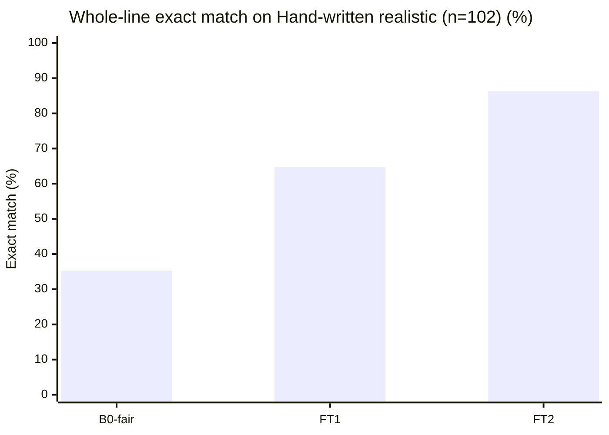
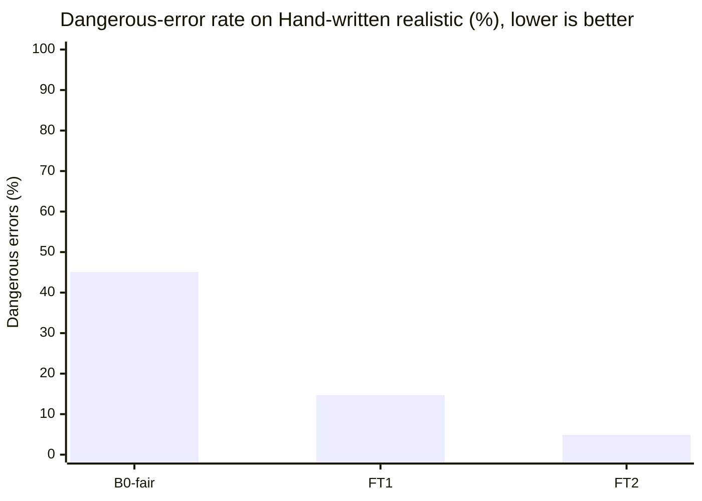
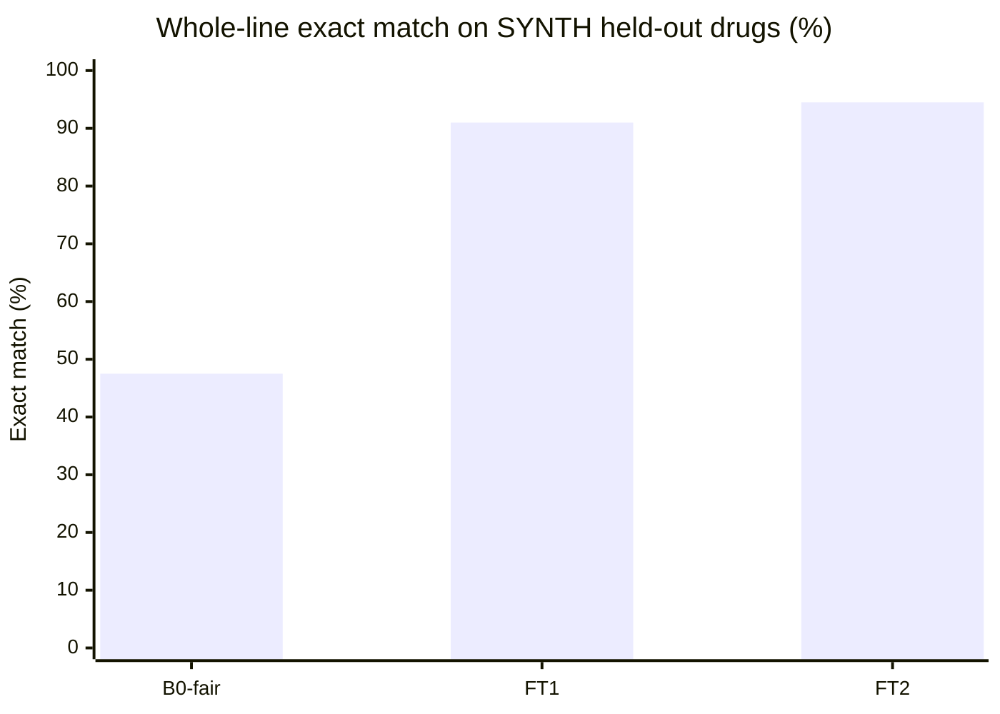
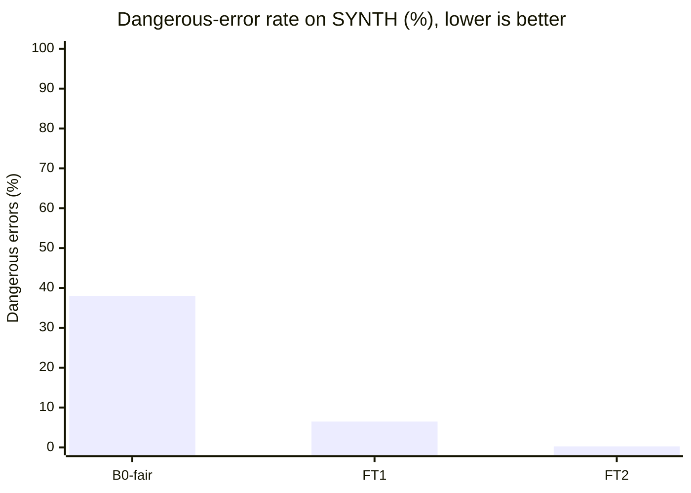

# Eval results

Numbers in this file come only from `eval/eval.py` runs saved under `eval/out/`. Values marked TODO have not been measured. Never invent numbers. A set is called **REAL** only when it is transcribed from photographed prescriptions. That set does not exist yet.

## What changed for FT2 (IDEA.md §8.6)

FT1 error buckets on the **old** synth_test (n=400, exact 0.80, danger 0.105): form 0.8875, dose 0.8925 (mostly unit), food 0.9125. Source: `eval/out/ft1_synth_test_old.json`. Root causes: Hindi/Marathi/Hinglish templates omitted form; doctor_short always said Tab; PRN gold.food was random while the line had no food token.

Fixes in the product and in v2 data:
- Every template style writes a form token; PRN gold.food is `any`.
- `copy_explicit` copies unique form/food/1/12 tokens from the line after Tinker parse. It never invents dose slots.
- 500 targeted train rows (form/unit, food, half-tab, taper, PRN, ASK) mixed into 2000 mix rows → `data/synth/train.jsonl` n=2500.

**Comparability:** train/val/synth_test were regenerated with form-in-line. B0 / FT1 / FT2 below are scored on this **new** held-out synth_test (n=400, 38 held-out drugs). The old FT1 row (exact 0.80 on the old test) is a footnote, not the headline.

**Hand-written realistic (n=102)** is `data/heldout/handwritten_realistic.jsonl`, never used in training. Gold is typed against the written line. These are de-identified typical family / caregiver slips (clinic print, doctor shorthand, WhatsApp, ASK). They are **not** photographed prescriptions. Photographed family files stay gitignored in `data/real/raw/`. Gemma 4 31B (Google AI Studio) stays TODO until `GEMINI_API_KEY` is used with consent. B1 (local Gemma E4B) stays TODO without a local pull.

JSON-valid in the headline table is SYNTH. Hand-written realistic json_valid is in its own section. **B0-fair** is the base-model baseline (same prompt as FT2, plus 3 few-shot examples and JSON-only instructions, same `_extract_json` parser). The old zero-shot B0 is a footnote.

| System | JSON valid | Exact match (hand-written realistic) [95% CI] | Dangerous errors (hand-written realistic) | Exact match (SYNTH) [95% CI] | Dangerous errors (SYNTH) | p50 s/line (Tinker) | Files |
|---|---|---|---|---|---|---|---|
| B0-fair Qwen3-8B base | 0.8025 | 0.353 [0.255, 0.451] | 0.451 | 0.475 [0.428, 0.525] | 0.38 | 3.20 | `eval/out/b0_fair_synth_test.json` · `eval/out/b0_fair_handwritten_realistic.json` |
| B1 Gemma 4 E4B | TODO | TODO | TODO | TODO | TODO | TODO | — |
| FT1 Qwen3-8B + LoRA v1 | 0.97 | 0.647 [0.559, 0.745] | 0.147 | 0.91 [0.88, 0.9375] | 0.065 | 2.18 | `eval/out/ft1_synth_test.json` · `eval/out/ft1_handwritten_realistic.json` |
| FT2 Qwen3-8B + LoRA v2 | 1.0 | 0.863 [0.794, 0.931] | 0.049 | 0.945 [0.9225, 0.9675] | 0.0025 | 3.16 | `eval/out/ft2_synth_test.json` · `eval/out/ft2_handwritten_realistic.json` |
| T Gemma 4 31B (AI Studio) | TODO | TODO | TODO | TODO | TODO | n/a (API) | — |

## SYNTH per-field (n=400, new held-out test)

Sources: `eval/out/b0_fair_synth_test.json`, `eval/out/ft1_synth_test.json`, `eval/out/ft2_synth_test.json`.

| Field | B0-fair | FT1 | FT2 |
|---|---|---|---|
| json_valid | 0.8025 | 0.97 | 1.0 |
| exact | 0.475 | 0.91 | 0.945 |
| danger | 0.38 | 0.065 | 0.0025 |
| drug | 0.7775 | 0.9525 | 0.98 |
| strength | 0.72 | 0.97 | 1.0 |
| form | 0.8025 | 0.97 | 1.0 |
| kind | 0.7875 | 0.9625 | 1.0 |
| dose | 0.575 | 0.9675 | 0.9975 |
| every_n_days | 0.7925 | 0.97 | 1.0 |
| taper | 0.7875 | 0.97 | 1.0 |
| food | 0.785 | 0.96 | 0.97 |
| duration_days | 0.7725 | 0.9375 | 0.9975 |
| prn_max_per_day | 0.7975 | 0.9625 | 0.995 |

p95 s/line: B0-fair 3.30 · FT1 3.18 · FT2 3.91.

## Paired FT1 vs FT2 (same 400 SYNTH lines)

McNemar discordant pairs on exact match: **14** lines FT2-correct / FT1-wrong, **0** lines FT1-correct / FT2-wrong. Dangerous errors: 26 → 1. Sources: `eval/out/ft1_synth_test_preds.jsonl`, `eval/out/ft2_synth_test_preds.jsonl`.

## B0 footnote (why the old baseline scored 0.0)

The original B0 used SYSTEM_PROMPT + the line, no few-shot, no enum/dose-object reminder. It **does** emit JSON-shaped text (spot-check: Glycomet line, 165 chars) and fails `MedLine` on every line: `form="TAB"`, `dose="1-0-1"` as a string, `food="AFTER FOOD"`, `kind="regular"`. `json_valid` 0.0 is schema validity, not empty output. Sources: `eval/out/b0_synth_test.json`, `eval/out/b0_handwritten_realistic.json`.

**B0-fair** keeps the same Tinker base Qwen3-8B and the same `_extract_json` + `copy_explicit` parser, and adds (1) the FT2 system prompt, (2) JSON-only / enum / dose-object instructions, (3) 3 few-shot gold pairs from train, none of which appear in either eval set. SYNTH json_valid 0.8025, exact 0.475. Hand-written realistic json_valid 0.755, exact 0.353. Remaining misses are mostly dose (object slots) and strength. The LoRA still lifts exact match 0.475 → 0.945 on SYNTH and 0.353 → 0.863 on hand-written realistic.

## FT2 remaining SYNTH misses

22 inexact lines. 12 are `food` on ASK/hard-negative slips with no food token (gold still carried a random food; clerk copies `any`). 8 are the held-out combo brand **Telma AM**. 1 dangerous error (dose or duration wrong and `needs_check` empty). Source: `eval/out/ft2_synth_test.json`.

## Footnote: old synth_test (pre form-in-line)

FT1 on the previous 400-line file, after `0` vs `0.0` rescore: json_valid 0.99, exact 0.80 [0.76, 0.84], danger 0.105, form 0.8875, dose 0.8925, food 0.9125, p50 2.17 s. Saved as `eval/out/ft1_synth_test_old.json`.

## Hand-written realistic (n=102, never trained, not photographed)

Scored with `eval/eval.py` on `data/heldout/handwritten_realistic.jsonl`. Sources: `eval/out/b0_fair_handwritten_realistic.json`, `eval/out/ft1_handwritten_realistic.json`, `eval/out/ft2_handwritten_realistic.json`.

| Field | B0-fair | FT1 | FT2 |
|---|---|---|---|
| json_valid | 0.755 | 0.941 | 0.990 |
| exact | 0.353 | 0.647 | 0.863 |
| danger | 0.451 | 0.147 | 0.049 |
| drug | 0.725 | 0.882 | 0.931 |
| strength | 0.559 | 0.725 | 0.922 |
| form | 0.725 | 0.922 | 0.971 |
| kind | 0.755 | 0.941 | 0.990 |
| dose | 0.529 | 0.912 | 0.951 |
| every_n_days | 0.745 | 0.922 | 0.990 |
| taper | 0.755 | 0.941 | 0.990 |
| food | 0.755 | 0.941 | 0.990 |
| duration_days | 0.725 | 0.873 | 0.990 |
| prn_max_per_day | 0.745 | 0.922 | 0.990 |

p50 s/line: B0-fair 3.13 · FT1 2.22 · FT2 3.20. p95: B0-fair 3.32 · FT1 3.48 · FT2 4.22.

Paired FT2 vs FT1 on the same 102 lines: **25** exact-match fixes, **3** regressions (McNemar n01=25, n10=3). Dangerous errors: 15 → 5. Sources: `eval/out/ft1_handwritten_realistic_preds.jsonl`, `eval/out/ft2_handwritten_realistic_preds.jsonl`.

FT2 remaining misses: 14 inexact lines. Error-field counts: strength 8, drug 7, dose 5, form 3. Hindi/Marathi Devanagari brand names vs Latin gold, combo brands, and insulin units are the main buckets. Food is 0.990 (1 miss).

**Limits:** no second labeller, no photographed originals in-repo, one author typed gold. IDEA.md §8.1 still wants a second human on family photos.

Extra synthetic form/dose/food stress: 400 rows in `data/synth/targeted_form_dose_food.jsonl`, 396 unique lines appended to `train.jsonl` (now 2896). FT2 weights were trained on the 2500-row mix; the extra 396 are for a later v3 run.

