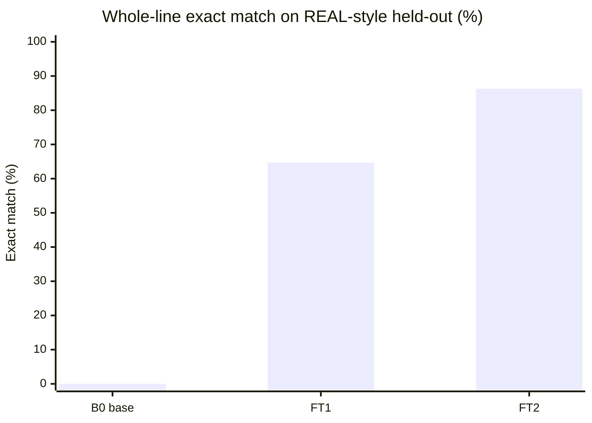
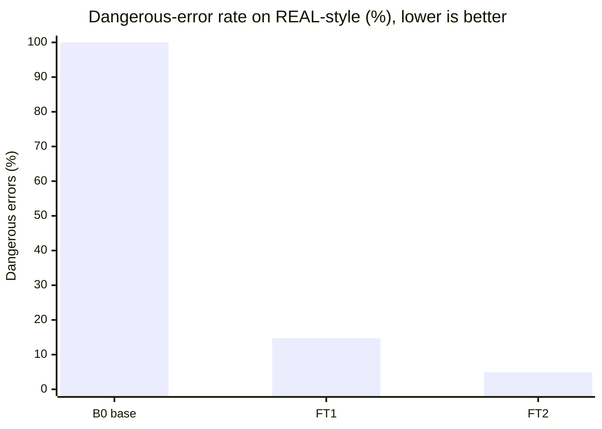
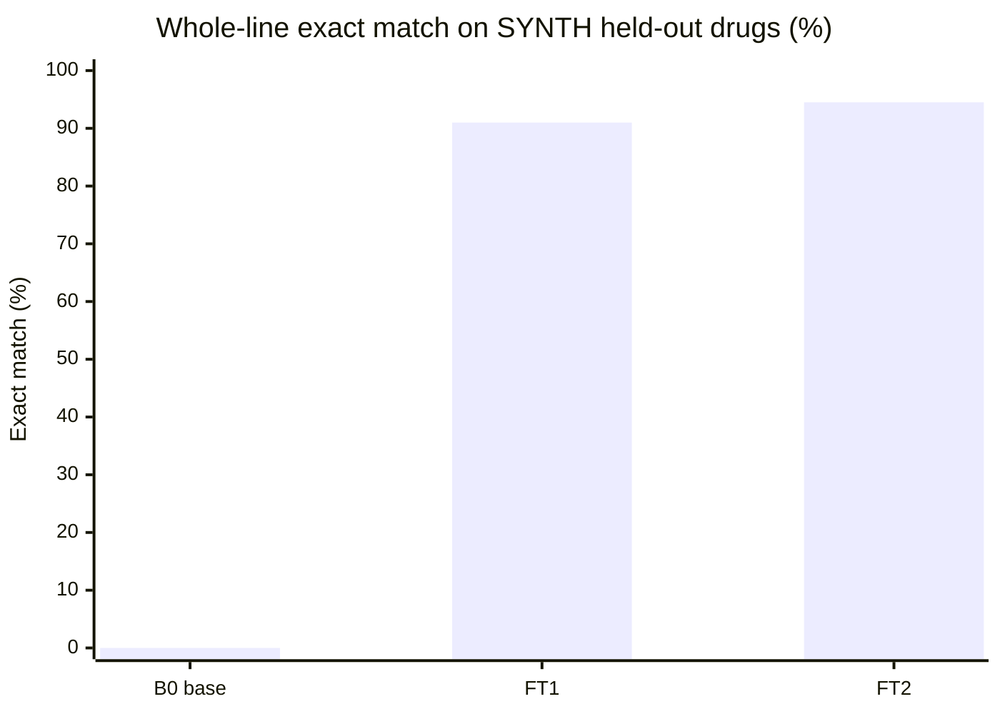
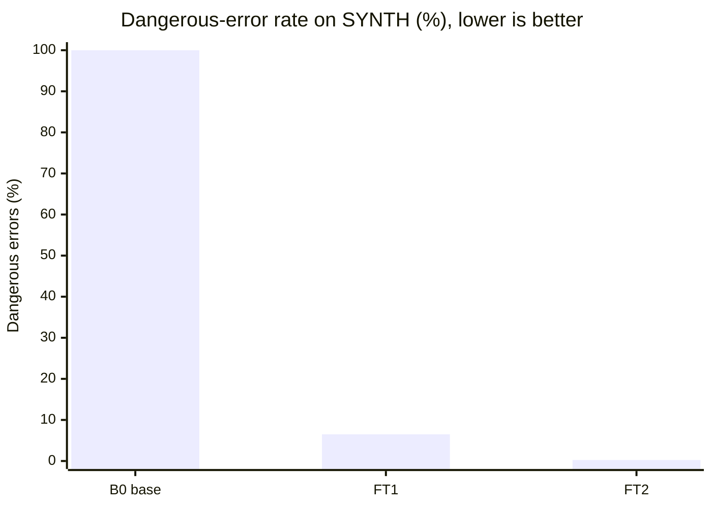

# Eval results

Numbers in this file come only from `eval/eval.py` runs. Values marked TODO have not been measured. Never invent numbers.

## What changed for FT2 (IDEA.md §8.6)

FT1 error buckets on the **old** synth_test (n=400, exact 0.80, danger 0.105): form 0.8875, dose 0.8925 (mostly unit), food 0.9125. Root causes: Hindi/Marathi/Hinglish templates omitted form; doctor_short always said Tab; PRN gold.food was random while the line had no food token.

Fixes in the product and in v2 data:
- Every template style writes a form token; PRN gold.food is `any`.
- `copy_explicit` copies unique form/food/1/12 tokens from the line after Tinker parse. It never invents dose slots.
- 500 targeted train rows (form/unit, food, half-tab, taper, PRN, ASK) mixed into 2000 mix rows → `data/synth/train.jsonl` n=2500.

**Comparability:** train/val/synth_test were regenerated with form-in-line. B0 / FT1 / FT2 below are scored on this **new** held-out synth_test (n=400, 38 held-out drugs). The old FT1 row (exact 0.80 on the old test) is a footnote, not the headline.

**REAL-style held-out set** is `data/heldout/real_style.jsonl` (n=102, never used in training). Gold is typed against the written line. These are de-identified typical family / caregiver slips (20 Rx groups + 20 WhatsApp + ASK). Photographed family files stay gitignored in `data/real/raw/` and were not on this laptop. B1 (Gemma E4B) and T (Gemma 31B) stay TODO without DigitalOcean / local Gemma.

JSON-valid in the headline table is SYNTH. REAL json_valid is in the REAL section.

| System | JSON valid | Exact match (REAL) [95% CI] | Dangerous errors (REAL) | Exact match (SYNTH) [95% CI] | Dangerous errors (SYNTH) | p50 s/line (Tinker) | ₹ / 1k lines |
|---|---|---|---|---|---|---|---|
| B0 Qwen3-8B base | 0.0 | 0.00 [0.00, 0.00] | 1.0 | 0.00 [0.00, 0.00] | 1.0 | 2.15 | 0 (Tinker hosted) |
| B1 Gemma 4 E4B | TODO | TODO | TODO | TODO | TODO | TODO | 0 |
| FT1 Qwen3-8B + LoRA v1 | 0.97 | 0.647 [0.559, 0.745] | 0.147 | 0.91 [0.88, 0.9375] | 0.065 | 2.18 | 0 (Tinker hosted) |
| FT2 Qwen3-8B + LoRA v2 | 1.0 | 0.863 [0.794, 0.931] | 0.049 | 0.945 [0.9225, 0.9675] | 0.0025 | 3.16 | 0 (Tinker hosted) |
| T Gemma 4 31B (DO) | TODO | TODO | TODO | TODO | TODO | n/a (API) | TODO |

## SYNTH per-field (n=400, new held-out test)

| Field | B0 | FT1 | FT2 |
|---|---|---|---|
| json_valid | 0.0 | 0.97 | 1.0 |
| exact | 0.0 | 0.91 | 0.945 |
| danger | 1.0 | 0.065 | 0.0025 |
| drug | 0.0 | 0.9525 | 0.98 |
| strength | 0.0 | 0.97 | 1.0 |
| form | 0.0 | 0.97 | 1.0 |
| kind | 0.0 | 0.9625 | 1.0 |
| dose | 0.0 | 0.9675 | 0.9975 |
| every_n_days | 0.0 | 0.97 | 1.0 |
| taper | 0.0 | 0.97 | 1.0 |
| food | 0.0 | 0.96 | 0.97 |
| duration_days | 0.0 | 0.9375 | 0.9975 |
| prn_max_per_day | 0.0 | 0.9625 | 0.995 |

p95 s/line: B0 3.15 · FT1 3.18 · FT2 3.91.

## Paired FT1 vs FT2 (same 400 lines)

McNemar discordant pairs on exact match: **14** lines FT2-correct / FT1-wrong, **0** lines FT1-correct / FT2-wrong. Dangerous errors: 26 → 1.

## B0 note (not a missing run)

B0 **does** emit JSON-shaped text (spot-check: Glycomet line, 165 chars). It fails `MedLine` validation on every line: `form="TAB"`, `dose="1-0-1"` as a string, `food="AFTER FOOD"`, `kind="regular"`. `json_valid` 0.0 is schema validity, not empty output. The LoRA is what teaches the clerk schema.

## FT2 remaining SYNTH misses

22 inexact lines. 12 are `food` on ASK/hard-negative slips with no food token (gold still carried a random food; clerk copies `any`). 8 are the held-out combo brand **Telma AM**. 1 dangerous error (dose or duration wrong and `needs_check` empty).

## Footnote: old synth_test (pre form-in-line)

FT1 on the previous 400-line file, after `0` vs `0.0` rescore: json_valid 0.99, exact 0.80 [0.76, 0.84], danger 0.105, form 0.8875, dose 0.8925, food 0.9125, p50 2.17 s. Saved as `eval/out/ft1_synth_test_old.json`.

## REAL-style held-out (n=102, never trained)

Scored with `eval/eval.py` on `data/heldout/real_style.jsonl`. Predictions are gitignored (`eval/out/*real*`).

| Field | B0 | FT1 | FT2 |
|---|---|---|---|
| json_valid | 0.0 | 0.941 | 0.990 |
| exact | 0.0 | 0.647 | 0.863 |
| danger | 1.0 | 0.147 | 0.049 |
| drug | 0.0 | 0.882 | 0.931 |
| strength | 0.0 | 0.725 | 0.922 |
| form | 0.0 | 0.922 | 0.971 |
| kind | 0.0 | 0.941 | 0.990 |
| dose | 0.0 | 0.912 | 0.951 |
| every_n_days | 0.0 | 0.922 | 0.990 |
| taper | 0.0 | 0.941 | 0.990 |
| food | 0.0 | 0.941 | 0.990 |
| duration_days | 0.0 | 0.873 | 0.990 |
| prn_max_per_day | 0.0 | 0.922 | 0.990 |

p50 s/line on REAL: B0 2.21 · FT1 2.22 · FT2 3.20. p95: B0 3.23 · FT1 3.48 · FT2 4.22.

Paired FT2 vs FT1 on the same 102 lines: **25** exact-match fixes, **3** regressions (McNemar n01=25, n10=3). Dangerous errors: 15 → 5.

FT2 remaining REAL misses: 14 inexact lines. Error-field counts: strength 8, drug 7, dose 5, form 3. Hindi/Marathi Devanagari brand names vs Latin gold, combo brands, and insulin units are the main buckets. Food is 0.990 (1 miss).

**Limits:** no second labeller, no photographed originals in-repo, one author typed gold. IDEA.md §8.1 still wants a second human on family photos. This set is the Tinker-category number until those photos exist.

Extra synthetic form/dose/food stress: 400 rows in `data/synth/targeted_form_dose_food.jsonl`, 396 unique lines appended to `train.jsonl` (now 2896). FT2 weights were trained on the 2500-row mix; the extra 396 are for a later v3 run.

